# JavaEE 学习笔记

## JVM

Java 的全部代码都运行在 JVM 上，JVM 通过对 Java 的相关操作进行编译，进而在不同的操作系统平台上面使用

与 C++ 不同的是，C++在面对 Linux、MacOS、Windows 等操作系统时，实现一个业务的逻辑需要写几套不同的代码，而 Java 一套代码就可以搞定，这都来自于 JVM 的功劳，JVM 可以根据当前 Java 所编写的代码在不同的运行平台上进行编译，进而得以在不同的操作系统下运行。

Java虚拟机（Java Virtual Machine, JVM）是执行 Java 字节码的运行时环境。它是 Java 技术的核心组件，负责实现 Java 的跨平台特性，同时提供内存管理、垃圾回收等重要功能。以下是 JVM 的详细介绍，包括其体系结构、工作原理、特点和常见问题。

---

### JVM 的作用

- **跨平台性**：JVM 提供了“**编译一次，运行到处**”的能力。Java 源代码被编译成平台无关的字节码（.class 文件），JVM 可以在不同操作系统中解释运行字节码。
- **内存管理**：JVM 自动分配和释放内存，开发者无需手动管理内存。
- **安全性**：JVM 提供了沙箱环境，限制程序访问系统资源，增强安全性。
- **多线程支持**：通过内置的线程模型，JVM 能高效管理并发执行的线程。
- **垃圾回收（Garbage Collection, GC）**：自动管理对象生命周期，回收不再使用的内存，减少内存泄漏问题。

---

## 操作系统

对上（软件）为软件提供了一个稳定的运行环境

对下（硬件）管理各种计算机设备

### 进程

运行的程序在操作系统中以进程的形式存在，是操作系统分配资源的最小单位 

#### 进程控制块抽象（PCB Process Control Block）

**1、PID：**进程编号，在操作系统当前运行环境中是唯一的

**2、内存指针：**每一个程序运行之前，操作系统都应在内存中为其分配一个内存空间，内存指针用于管理这块空间

**3、文件描述符表**

当程序运行起来之后需要访问一些文件资源，这时操作系统就负责为这些程序分配各种资源。程序需要的每一个文件，都是一个**文件描述符**，多个文件描述符合在一起，就组成了文件描述符表，类似于一个**集合**，在 Linux 中，所有的计算机设备，都是用文件的方式去描述（网卡、磁盘、外接设备等都是通过一个设备进行描述），默认每个程序运行时都会分配三个文件描述符：

默认每个程序运行时都会分配以下三个文件描述符：

标准输入：`System.in`

标准输出：`System.out`

标准错误：`System.error`

**4、进程状态：**就绪和阻塞

**5、进程调度：**

一个逻辑处理器，在处理许多进程时，采用的是轮换执行方法，由于 CPU 执行的频率很开因而人们察觉不出

**并发**：在一个逻辑处理器上**轮换执行**进程称为“并发”，重点是轮换执行

**并行**：在多个逻辑处理器上**同时处理**不同的指令称为“并行”，重点是同时处理

**在 Java 中，不对并发与并行进行区分，统称为“并发编程”。** 

**6、进程的优先级：**

对每个进程划分优先级，优先级越大，表示这个进程越有机会到 CPU 上执行。

**7、进程的上下文：**

进程在轮换执行时，会出现暂停执行（轮换出）和恢复执行（轮换到）两种状态，在轮换出是，需要保存进程执行的相关状态以便恢复执行时 CPU 可以得知当前进程执行到什么情况了，这是就需要将当前进程在寄存器中的数据存储到文到内存中，这个数据称为进程的上下文，在恢复执行时，将当前进程在内存中的上下文信息加载入寄存器中，CPU 得以继续执行。

进程暂停执行时：寄存器 ---> 内存

进程继续执行时：内存 ---> 寄存器

**8、进程的组织方式**

将每个进程抽象成一个 PCB，然后通过 PCB 以一个双向链表进行管理

查看所有的进程就是遍历这个双向链表

---

### 内存管理

使用 MMU（内存管理单元）同意虚拟内存的方式来管理进程对内存的使用


通过 MMU 对多个进程进行了内存的隔离，那么如何进行进程之间的通信来让多个进程协作完成一些任务呢？


## 多线程初阶

### 什么是线程

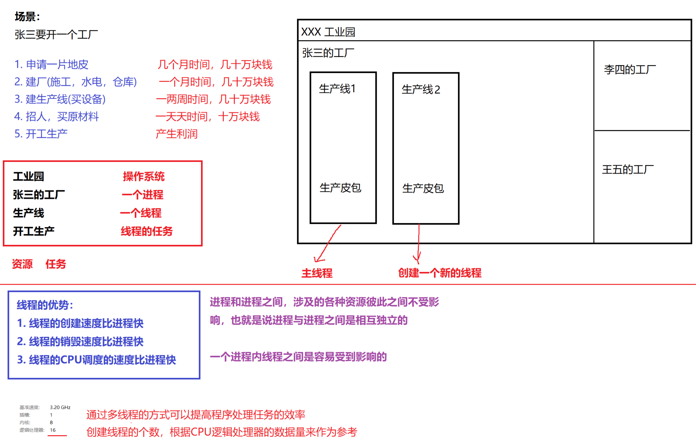

#### 线程与进程的区别

- 进程是包括线程的，每个进程至少有一个线程存在，即主线程。
- 进程和进程之间不共享内存空间，同一个进程的线程之间共享同一个内存空间。
- 进程是系统分配资源的最小单位，线程是 CPU 调度的最小单位。
- 一个进程挂了一般不会影响其他进程，但是一个线程挂了，可能会把同进程内的其他线程一起带走（整个进程崩溃）。

#### 多线程的场景

（过多线程会造成什么问题？）

1. 当线程的数量小于逻辑处理器的个数时，使用多线程操作能够提高程序处理任务的效率；
2. 当线程的数量大于逻辑处理器的个数时，使用多线程操作会拉低程序处理任务的效率，因为要涉及线程的不断摧毁与创建。

---

### 创建线程

（继承 Thread 类、实现 Runnable 接口、Lambda 表达式）

**1. 继承 Thread 类，然后重写 Thread 类中的 run 方法：**

```java
class Mythread extends Thread{
		@override
		public void run() {
        while (true) {
            try {
                Thread.sleep(1000);
            } catch (InterruptedException e) {
                throw new RuntimeException(e);
            }
            System.out.println("Hello, my little thread!");
        }
    }
}
  
// main()
Mythread demo = new Mythread();
demo.start(); // 开启线程，并执行线程中的 run 方法中的程序逻辑。
```

**2. 实现 Runnable 接口，将线程类与业务逻辑解耦，符合高内聚，低耦合的编码理念：**

```java
// 定义具体的业务逻辑类
class MyRun implements Runnable{
  	@override
  	public void run(){
      	while (true){
            try {
                Thread.sleep(1000);
            } catch (InterruptedException e) {
                throw new RuntimeException(e);
            }
            System.out.println("Hello, my little thread!");
        }
    }
}

// main()
MyRun myRun = new MyRun(); // 实例化业务逻辑对象
Thread myThread = new Thread(myRun); // 调用另外一个构造方法，通过接收实现 Runnable 接口的对象创建
myThread.start(); // 开启线程，并执行线程中的 run 方法中的程序逻辑。
```

**3. 因为 Runnable 接口只有一个方法，所以是一个函数式接口，可以使用 Lambda 表达式内部匿名重写方法：**

```java
// main()
Thread myThread = new Thread(() -> {
    	while (true){
            try {
                Thread.sleep(1000);
            } catch (InterruptedException e) {
                throw new RuntimeException(e);
            }
            System.out.println("Hello, my little thread!");
        }
  	}
);
myThread.start(); // 开启线程，并执行线程中的 run 方法中的程序逻辑。
```

---

### 线程的各种属性

- `ID`：**`getID()`**  
  - `JVM` 中默认为 `Thread` 对象生成一个编号，是 `Java` 层面的，要和 `PCB` （操作系统层面的）区分开。
- 名称：**`getName()`**  
  - `Thread` 类还有一个构造方法可以同时接收 `Runnable` 的实现接口对象和 `String` 对象，来设置线程对象的名字。
- 状态：**`getState()`**
  - `Java` 层面定义的线程状态，要与 `PCB` 区分开。
- 优先级：**`getPriority()`**
- 是否后台线程：**`isDaemon()`**
  - 线程分为前台线程和后台线程，前台线程可以阻止进程的结束，主线程结束前台线程依然存在。
  - 后台线程则不能，主线程结束，后台线程也随之结束。
- 是否存活：**`isAlive()`**
  - 表示当前线程所对应的系统中的 `PCB` 是否销毁，与 `thread` 对象没啥关系。
  - `Thread` 是 `Java` 中的类 --> 创建 `Thread` 对象 --> 调用 `start()` 方法 --> `JVM` 调用操作系统 `API` 生成一个 `PCB` --> `PCB` 与 `Thread` 对象一一对应。
  - `Thread` 对象与 `PCB` 所处的环境不同（一个 `Java` 环境，一个操作系统环境），所以他们的生命周期也不同。
  - 线程结束时，`PCB` 被销毁，但是管理这个现成的 `Java` 对象可能还存在于内存中。
- 是否被中断：**`isInterrupted()`**
  - 通过设置一个标志位让线程在执行是判断是否要退出。

---

### 线程中断

（自定义中断标志位，`JDK` 提供的方法）

1. 自定义一个中断标志位，通过修改这个标志位的值来通知线程中断，这个变量需使用全局变量。

```java
public static void main(String[] args) throws InterruptedException {
        Thread myThread = new Thread(() -> {
            while (!isQuit){
                try {
                    Thread.sleep(1000);
                } catch (InterruptedException e) {
                    throw new RuntimeException(e);
                }
                System.out.println("Hello, my little thread!");
            }
        }, "myThread");
        myThread.start();
        Thread.sleep(1000);
        System.out.println(myThread.getName() + "将在 10s 钟后触发中断标志位。");
        Thread.sleep(10000);
        isQuit = true;
        System.out.println(myThread.getName() + "中断标志位已触发，线程中断。");
}
```

2. 调用 `interrupt()` 方法中断线程，因为是 `JDK` 官方 `API`，会比自定义中断标志位代码更清晰，中断更及时。

   - 中断正常执行任务的线程

     ```java
     public static void main(String[] args) throws InterruptedException {
             Thread myThread = new Thread(()->{
                 while (!Thread.currentThread().isInterrupted()){
                     System.out.println("Hello, my little thread!");
                 }
             }, "myThread");
             System.out.println(myThread.getName() + " 是否存活：" + myThread.isAlive());
             myThread.start();
             myThread.interrupt();
     }
     ```
   - 中断有 `sleep()` 方法的线程，这里中断的时候极大概率会在线程休眠状态的时候中断，因为线程正常工作的时间窗口极短，很难碰到，为此会中断处于 `sleep` 状态线程，在 `Java` 中，中断处于 `sleep` 状态的线程时，会抛出`InterruptedException`异常，此时不可正常中断线程，需要在捕获异常处的代码块内，再次调用 `interrupt()` 方法中断线程。
   
   ```java
   		public static void main(String[] args) throws InterruptedException {
           Thread myThread = new Thread(()->{
               while (!Thread.currentThread().isInterrupted()){
                   try {
                       Thread.sleep(1000);
                   } catch (InterruptedException e){
                       // 当中断处于 sleep 状态的线程时，会触发此异常
                       // 此时不可正常中断线程，需要在捕获异常处的代码块内，手动中断
                       System.out.println("触发了中断异常 (InterruptedException)");
                       System.out.println("重新中断线程");
                       Thread.currentThread().interrupt();
                   }
                   System.out.println("Hello, my little thread!");
               }
           }, "myThread");
           System.out.println(myThread.getName() + " 是否存活：" + myThread.isAlive());
           myThread.start();
           System.out.println(myThread.getName() + " 是否存活：" + myThread.isAlive());
           System.out.println(myThread.getName() + " 将在 2s 钟后触发中断标志位。");
           Thread.sleep(2000);
           myThread.interrupt();
           System.out.println(myThread.getName() + "中断标志位已触发。");
           System.out.println(myThread.getName() + " 是否存活：" + myThread.isAlive());
       }
   ```
   
---

### 线程等待

**`thread.join()`：** 等待 `thread` 线程结束在执行后续代码，无论是线程中断还是正常退出都算线程结束。

```Java
public static void main(String[] args) throws InterruptedException {
        Thread myThread_01 = new Thread(()->{
            for (int i = 0; i < 5; i++) {
                try {
                    Thread.sleep(1000);
                } catch (InterruptedException e) {
                    throw new RuntimeException(e);
                }
                System.out.println("Hello, my little thread_01!");
            }
        }, "myThread_01");
        Thread myThread_02 = new Thread(()->{
            for (int i = 0; i < 5; i++) {
                try {
                    Thread.sleep(1000);
                } catch (InterruptedException e) {
                    throw new RuntimeException(e);
                }
                System.out.println("Hello, my little thread_02!");
            }
        }, "myThread_02");
        myThread_01.start();
        myThread_02.start();
        // 等待两个线程结束后再执行后续代码
        myThread_01.join();
        myThread_02.join();
        System.out.println("Goodbye, the main thread!");
}
```

---

### 线程状态

线程一共有以下五个状态：

- **`NEW`：**表示管理线程的 `Thread` 对象已经实例化，但还未创建 PCB。
- **`RUNNABLE`：**表示线程处于就绪状态，可分为正在工作中和即将开始工作。
- **`BLOCKED`：**线程处于阻塞状态，表示获取到了锁，正在等待锁释放。
- **`WAITING`：**表示线程处于无限期等待状态，直到收到了中断信号。（一般是通过锁对象使得进程处于 `WAITING` 状态）
- **`TIMED_WAITING`：**表示线程处于有限期等待状态，直到等待时间结束。
- **`TERMINATED`：**表示线程已经执行完毕，`PCB` 已经销毁。

---

### 线程安全

#### 线程不安全的原因

1. **线程之间是抢占式执行的（执行顺序是随机的）。**

   线程的执行顺序完全由 `CPU` 调度决定，无法进行人为控制，抢占式执行是引起线程安全的主要原因。

2. **多个线程对同一个变量进行了修改（修改共享变量）**。

   - 多个线程对同一个变量进行了修改，会引起线程安全问题。
   - 多个线程各自修改不同的变量，不会引起线程安全问题。
   - 一个线程对同一个变量进行了修改，不会引起线程安全问题。

3. **`Java` 语句不能完全保证原子性。**

   - 操作系统只能保证 `CPU` 指令的原子性（一次只能执行一条指令）。
   - 对于 `count++` 语句而言，会涉及到以下三条 `CPU` 指令：
     - 从进程公共内存中把 `count` 的值读取到线程工作内存中。(`LOAD`)
     - 对线程工作内存的 `count` 进行 `+1` 操作。( `ADD` )
     - 把 `+1` 之后的结果写入进程公共内存中。(`STORE`)
   - 由于 `CPU` 指令的原子性，在重新写入内存时，在一瞬时只能执行一条指令，会引发冲突，可能线程 `A` 刚写入，线程 `B` 就又写入了，为此引发了线程安全问题。

4. **没有满足内存可见性。**

   内存可见性指的是一个线程对共享变量的修改可以被其他线程看到。如果没有满足内存可见性，会引发同时对共享变量进行修改但线程彼此之间不知道，就会引发线程安全问题。

   `JVM` 重新定义了 `Java` 的内存工作环境，`JMM (Java memory model)`，⽬的是屏蔽掉各种硬件和操作系统的内存访问差异，以实现让Java程序在各种平台下都能达到⼀致的并发效果，如下图。JMM 定义每一个线程都有一个属于自己的工作内存，并且线程彼此之间的工作内存之间是隔离，线程彼此之间感知不到。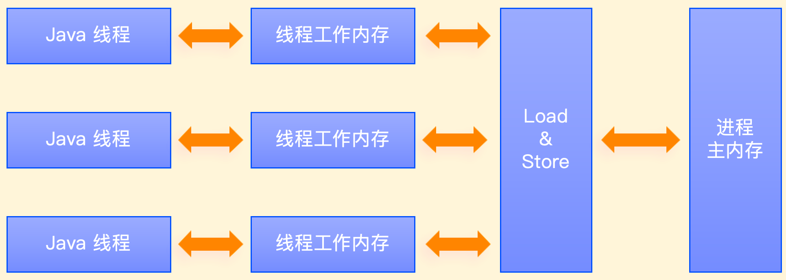

**JMM 的规定（面试题)：**
   - 所有线程不可之间修改主内存空间的共享变量。
   - 如果需要修改变量，需要把这个变量从主内存中读取到工作内存中，在工作内存中修改后，再写入主内存中。
   - 各个线程之间彼此无法直接相互通信，做到了内存级别的线程隔离。（可以通过锁实现间接性的通信，来感知线程彼此之间的存在）


5. **指令重排序。**

​	如果是在单线程情况下，JVM、CPU指令集会对程序代码进⾏优化，在保证逻辑不变化的情况下优化代码，这一点在单线程环境下很容易判断，但是在多线程环境下就没那么容易了，多线程的代码执⾏复杂程度更⾼，编译器很难在编译阶段对代码的执行效果进行预测，因此过于激进的指令重排序很容易导致优化后的逻辑和之前不等价。

**在上述五条原因中，1、2 无法控制，所以我们只可以从 3、4、5 来保证线程安全，如下：**

1. **保证代码的原子性**
2. **保证内存可见性**
3. **禁用指令重排序。**

---

### `synchronized`

#### `synchronized` 解决的三个问题

**1. `synchronized` 解决了 Java 语句的原子性问题**

​	通过关键词 `synchronized` 修饰，`t1` 先获得到锁，执行加锁的代码块，代码块执行结束后释放锁，其他线程再竞争这个锁，当一个线程再修改一个共享变量时，因为修改变量的代码被加了锁，所以其他线程不可执行这段代码，保证了多个线程不会同时修改一个变量，也**保证了 Java 语句的原子性**，进而把多线程的代码逻辑强制变成单线程运行逻辑，从而解决了线程安全问题，

​	由于线程是抢占式执行，可能 `t1` 执行到 `ADD` 时被 `CPU` 调度出去，`t2` 获得执行机会，但是此时 `t1` 在持有锁，`t2` 无法执行锁内代码，只能继续等待，直到 `t1` 执行完成其加锁代码块并把锁释放掉之后才能继续执行，`t2` 在等待锁的这个状态就是 `BLOCK`（阻塞 ）。

下面是 `JMM` 中的原子操作（即在同时给一个变量执行指令时，一瞬时只能执行一条），按照使用流程来排序，分别如下：

- `lock`（锁定）：作用于主内存，它把一个变量标记为一条线程独占状态；
- `read`（读取）：作用于主内存，把变量值从主内存读取到线程的工作内存中；
- `load`（载入）：作用于工作内存，把 read 操作读取到的值放入到工作内存的变量副本中；
- `use`（使用）：作用于工作内存，把工作内存中的值传递给执行引擎，每当 JVM 需要使用这个变量时，就会执行这个动作；
- `assign`（赋值）：作用于工作内存，把从执行引擎获取到的值赋值给工作内存的变量；
- `store`（存储）：作用于工作内存，把工作内存中的一个变量传送到主内存中。
- `write`（写入）：作用于主内存，把 store 传回的值存放到主内存中的变量中。
- `unlock`（解锁）：作用于主内存，把一个处于锁定状态的变量释放出来。
- ....... （还有一些原子操作）

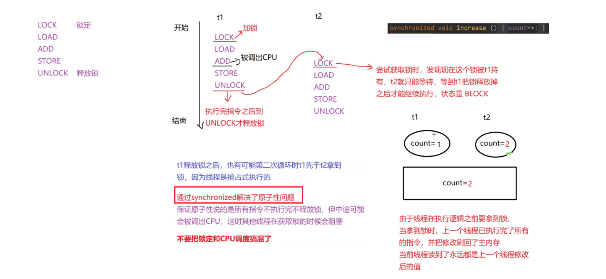

```java
public class Demo10_sychronized {
    static int count = 0;
    static final Object locker = new Object();
    public static void main(String[] args) throws InterruptedException {
        CounterDemo10 counterDemo10 = new CounterDemo10();
        Thread myThread_01 = new Thread(() -> {
            for (int i = 0; i < 50_0000; i++) {
                synchronized (locker){
                    ++count;
                }
            }
        }, "myThread_01");
        Thread myThread_02 = new Thread(() -> {
            for (int i = 0; i < 50_0000; i++) {
                synchronized (locker){
                    ++count;
                }
            }
        }, "myThread_02");
        myThread_01.start();
        myThread_02.start();
        
        myThread_01.join();
        myThread_02.join();
        System.out.println("count = "+ count);
    }
}

```

**2. `synchronized` 解决了内存可见性问题**

​	每一个线程都是从主内存中加载变量到自己的工作内存中，在自己的工作内存中修改后再写入主内存中，由于加了锁，一次 `count++` 只能由一个线程完成，每一个线程读到的值都是上一个线程写入内存中的值，因此主内存相当于一个交换空间，线程依次执行读取和写入动作，一个线程的修改动作能够被另一个线程感知到，使得线程彼此之间能够感受到对方的存在，通过这样的方式间接实现了内存可见性。


**`3. synchronized` 不会禁用指令重排序，因此不能保证指令的有序性！**

---

`synchronized` 对应线程安全可人为控制的三个问题的解决情况：

1. 可以保证 `Java` 语句的原子性。
2. 可以保证内存内存可见性。
3. 不保证指令的有序性。

---

#### 锁对象

线程获取锁，会有以下三种情况：

- 如果只有一个线程，那么可以直接获取锁，不会出现锁竞争。
- 线程 A 和线程 B 共同抢一把锁的时候，存在锁竞争，谁先拿到就先执行自己的逻辑，另外一个线程则阻塞等待，到持有锁的线程执行完毕释放锁后，再继续参与锁竞争去抢占这把锁，此时会出现锁竞争。
- 若线程 A 和线程 B 没有共同抢一把锁，则彼此之间不会出现锁竞争。

**如何判断多个线程是否在抢占一把锁呢？如何描述一把锁、锁与线程之间的关联如何？**（锁对象起了至关重要的作用）

任何一个实例对象都可以作为锁对象，在 `JVM` 中，所有的实例对象在内存中的结构都由以下 4 个区域组成：

1. **`markword`**：锁信息、`GC`（垃圾回收）次数、程序计数器。       （`8 byte`）
2. **类型指针**：记录当前的对象是哪一个类。                                    （`4 byte`）
3. **实例数据**：成员变量。                                                                 （不定）
4. **内存对齐填充**：一个对象所占的内存必须是 `8 byte` 的整数倍。（不定）

```java
Object obj = new Object();
System.out.println(ClassLayout.parseInstance(obj).toPrintable());
/**
OFF  SZ           TYPE DESCRIPTION               VALUE
  0   8        (object header: mark)     0x0000000000000001 (non-biasable; age: 0)
  8   4        (object header: class)    0x00000d68
 12   4        (object alignment gap)    
Instance size: 16 bytes
**/
```

​	所以，锁对象的 `markword` 中的锁信息存储的就是当前获取到锁的对象引用，其实本质上锁对象才是那把线程之间竞争的**锁**。当线程 `A` 获取到锁时，锁对象的锁信息指向线程 `A`，此时 CPU 调度到线程 `B` 时，由于锁对象的锁信息没有指向线程 `B`，所以线程 `B` 进入 `BLOCK` 状态，重新调度回线程 `A` 时，锁对象的锁信息指向一致，继续执行 `A` 的逻辑，执行完毕后，线程 `A` 释放锁，锁对象的锁信息指向空，所有线程继续竞争这个锁。

​	因为每一个对象在 JVM 中的内存结构中都会有 `markword` 区域，所以任何对象都可以作为一个锁对象来存储锁信息。锁对象被 `final` 修饰，被 `final` 修饰的引用变量不可以再指向其他对象，保证了锁对象始终都有引用变量指向。

​	**注意：多个线程只有使用同一个锁对象才存在竞争关系，才可以进行抢占式竞争，否则与没上锁一样。相当于一个门有多把锁，任意一把锁打开后，门就能开，所以压根就没有把门锁上，这些线程都可以拿到自己的锁对象把门打开，所以锁对象的意义就失去了。**

---

**判断当前锁对象是哪个：**

```java
public static synchronized void method() {}  // 类对象

public synchronized void method() {} // 实例对象

public void method(){  // 实例对象
  synchronized(this){}
}
```

#### synchronized 的三个特性 

1. **互斥性**

   加了锁以后，只有获取到锁的对象可以执行加锁代码块内的逻辑，其余线程需阻塞等待持有锁的线程释放锁后，再参与竞争获取锁。

2. **可重入**

   `synchronized` 代码块对于一个线程而言是可以重复加锁的，不会出现自己把自己锁死的情况，因为在 `markword` 区域中，除了存放使用锁的对象引用，还有一个“加锁计数器”：

   - 如果某个线程获取锁的时候，发现加锁的对象是自己，那么仍可以进入加锁代码块，加锁计数器自增。

   - 在释放锁的时候，也就是走到代码块末尾时，加锁计数器会自减，只有加锁计数器减到 `0` 时，才可以彻底释放锁。

3. **内存可见性**

   `synchronized` 关键字是通过实现了 `Java` 语句的原子性，使得加锁代码块在本质上时串行执行的，所以间接达成了内存可见性。

---

### volatile

#### 线程缓存不一致

```java
public class Demo12_volatile {
    static int flag = 0;
    public static void main(String[] args) {
        Thread myThread_01 = new Thread(() -> {
            while (flag == 0){

            }
            System.out.println(Thread.currentThread().getName() + " has been exited...");
        }, "myThread_01");

        myThread_01.start();

        Thread myThread_02 = new Thread(() -> {
            Scanner scanner = new Scanner(System.in);
            System.out.print("Input a number > ");
            flag = scanner.nextInt();
            System.out.println(Thread.currentThread().getName() + " has been exited...");
        }, "myThread_02");
        myThread_02.start();
    }
}
```

在上述这个代码中，得出的结果如下：

```java
Input a number > 1
myThread_02 has been exited...
```

在输入一个非零的数字后，线程 2 顺利结束，但是线程 1 仍然处于死循环，没有顺利退出循环，由此看出线程没有按照我们写好的代码去执行任务，引发了线程安全问题，这是由 `JMM`（`Java` 内存模型）的特性导致的。

计算机在执行程序时，会从内存中读取数据，然后加载到 `CPU` 中运行。由于 **`CPU` 执行指令的速度要比从内存中读取和写入的速度快的多**，所以如果每条指令都要和内存交互的话，会大大降低 `CPU` 的运行速度，造成昂贵的 `CPU` 性能损耗，为了解决这种问题，设计了 **`CPU` 高速缓存**。有了 `CPU` 高速缓存后，`CPU` 就不再需要频繁的和内存交互了，有高速缓存就行了，而 `CPU` 高速缓存，就是我们经常说的 `L1, L2, L3, cache`。

而当共享变量同时被加载到多个线程的工作内存中并在多线程中都同时进行操作时，当线程 `A` 修改了变量 `a` 后，线程 `B` 不知道 `a` 已经做了修改，继续推进线程 `B` 的线程工作，这样子，程序就会出现问题，因此就存在了缓存不一致问题。在上述代码中，线程 `1` 首先去主内存中把 `flag` 的值读取到自己的工作内存中，在线程 `1` 的代码中，`JVM` 发现线程 `1` 之后并没有对 `flag` 修改的动作，所以认为线程 `1` 中的 `flag` 变量是不会变的，所以每次在读取值的时候为了提高效率，就不会再去主内存中读取值，所以在线程 `2` 修改了 `flag` 的之后，线程 `1` 的工作内存中 `flag` 的值一直都没有发生变化，这就导致了线程之间的缓存不同步的问题，引发了线程安全问题。

---

#### volatile 原理

上述引发线程安全的本质在于，线程 `2` 修改了 `flag` 变量后，线程 `1` 中的 `flag` 仍然在使用旧的值，所以需要通知线程 `1` 当前所用的值已经失效了，需要重新去主内存中读取，这是解决这个线程问题的中心思想。在 `synchronized` 关键字中，当一个线程的执行逻辑需要读取一个共享变量时，就会对这一段执行逻辑的代码加锁，其他线程只有在这个线程释放锁后，再与这个线程继续参与锁竞争，最终这个执行逻辑就把一个并行处理的代码变成了串行执行。这显然是会影响执行效率的，为此 `volatile` 关键字换了一个思路，加入了一个指令级的锁来提升效率。`volatile` 与 `MESI` 缓存一致性协议共同保障了上述的线程安全问题。

 **`MESI` 缓存一致性协议**：该协议规定了处于线程工作内存中变量的四个状态：`Modified`、`Exclusive`、`Shared`、`Invalid`。`Modified` 意味着缓存行已被修改，与主存不同，且只有当前核心有该数据的副本；`Exclusive` 表示缓存行与主存一致，且只有当前核心有副本；`Shared` 表示缓存行与主存一致，但可能有其他核心共享；`Invalid` 则是无效状态，表示缓存行中的数据不可用。

对于上述的代码中的 while 循环判断，可以简单看成下列的原子操作：

```Java
   1. LOOP
   2. LOAD
   3. CMP
```

但是在不加 `volatile` 的情况下。JVM 会对线程 1 使用 `Loop Hoisting` 优化，因为其认为不会对 `flag` 进行修改，所以为了减少循环的指令条数，把 `flag` 从主内存读取到工作内存这一步读操作提升到了放在了 while 循环以外。接着当线程 2 对 `flag` 进行修改时，MESI 协议会将 `flag` 的物理缓存位置为无效，因为 MESI 协议的存在，每一次的读操作都会进行一遍物理缓存位校验，以检查当前变量是否已经与主内存不一致（如果不一致则进行更新），但是因为 JVM 将读操作提升到了循环以外，使得线程绕过了物理缓存检查，每一次的循环条件判断是都没有进行正确的读操作以更新工作内存。

所以加了 `volatile` 使用内存屏障禁用了指令重排序，使得上述这条读操作存在于循环内，所以每一次循环操作都会进行读取数据，在 MESI 将物理缓存位标记为无效时，物理缓存检查生效，使得线程重新去主内存对 flag 完成了读取。而因为加了 `volatile` 关键字，在对这个变量读写的时候，**无论物理缓存有没有标记为无效，在每一次的读取时，都会强制从主内存将 flag 的值读取到工作内存；在每一次的修改时，都会强制将工作内存中对 flag 的修改写入到主内存**，所以在 MESI 的物理缓存检查的基础上，弥补其对逻辑可见性的不足，又加固了一层安全性。

但是还有一个问题，如果在一个线程 `A` 在其工作内存中修改了 `flag` 变量后，其他 CPU 核心（线程）要重新去主内存中读取这个变量值，但是运行线程 `A` 的 CPU 核心还未将其修改的结果写入主内存，所以其他线程读到的还是旧的变量值，一样会出问题。为此，在线程 A 把加了 `volatile` 关键字的 `flag` 写入主内存之前，会使用 `lock` 指令前缀为 `store` 指令加锁（在 `store` 前加锁 `lock`，`write` 后 `unlock`），保证了其他线程只有在线程 A 把修改后的结果写入主内存之后，才可以重新去主内存读取 `flag` 的值，所以解决了上述因为线程工作内存中变量值不同步导致的线程安全问题。

所以说 `volatile` 解决问题的原理如下：

1. **使用内存屏障禁用了指令重排序**
2. **在使用内存屏障的时候引入了 `lock` 指令前缀这个指令级别的锁**
3. **在每一次的读写操作时，强制进行主内存与工作内存数据刷新**

**以上 ⬆️ 为 `volatile` 关键字解决线程安全问题的原理。**

与 `synchronized` 相比，`volatile` 也用到了锁，只是把锁的密度大大减小，是 `CPU` 指令级别的，性能非常高，一开始 `read` 的时候各个 `CPU` 都能`read`，但是在回写主内存的时候其他 `CPU` 没法运算，这个锁的密度非常小，只是锁定了 `store` 和 `write` 两个指令级操作，因此这个锁的消耗非常非常低，运行起来会非常快，提高了运行效率。

（感谢 `DeepSeek` 提供的帮助～）

---

#### `volatile` 三个问题的解决情况

**1、`volatile` 没有解决原子性问题**

​	同样以 `count++` 为例，在多个线程同时执行 `store` 指令时，一样会出现线程安全问题，即使此时变量已经标记为无效了，但是只会在 `CPU` 核心读取工作内存中的变量值时才会发现无效标志，在执行写入指令时，一样会把自己的工作内存的变量值写入主内存，所以没有解决原子性问题。

**2、`volatile` 解决了内存可见性问题**

​	在一个线程修改了变量值，会立马向主内存重新写入该变量值，进行刷新操作，其他 `CPU` 核心（线程）依靠**总线嗅探机制**发现自己工作内存中的该变量值已经无效了，进而直到主内存中的变量已经被修改了，所以解决了内存可见性问题。

**3、`volatile` 解决了指令重排序问题**

​	`volatile` 引入了内存屏障（`Memory barrier`），一共有以下四种：

- `LoadLoad`：执行顺序是 `Load1; LoadLoad; Load2` ，其中的 `Load1` 和 `Load2` 都是加载指令。`LoadLoad` 指令能够确保无论发生怎样的指令重排序，`Load1` 都一定会在 `Load2` 之前，。

- `StoreStore`：执行顺序是 `Store1; StoreStore; Store2` ，其中的 `Store1` 和 `Store2` 都是加载指令，`StoreStore` 指令够确保无论发生怎样的指令重排序，`Store1` 都一定会在 `Store2` 之前，。

- `LoadStore`：执行顺序是 `Load1; LoadStore; Store2` ，`StoreLoad` 指令够确保无论发生怎样的指令重排序，`Load1` 都一定会在 `Store2` 之前。

- `StoreLoad`：执行顺序是 `Store1; StoreLoad; Load2` ，`StoreLoad` 指令够确保无论发生怎样的指令重排序，`Store1` 都一定会在 `Load2` 之前。

因为以上四种内存屏障的使用，`volatile` 禁用了指令重排序，解决了指令重排序问题。

---

### `wait() & notify() & notifyAll()`

`wait()`是`Java`中的一个方法，同样属于`Object`类，用于使当前线程等待，直到其他线程调用此对象的`notify()`方法或`notifyAll()`方法，或者等待的时间超过指定的时间长度。调用`wait()`方法会释放当前线程持有的对象的锁，并导致当前线程进入等待状态。

- `wait()`方法必须在同步代码块或同步方法中调用，且必须持有调用该方法的对象的锁。
- 调用`wait()`方法会**释放当前线程持有的锁**，这是`wait()`和`sleep()`方法的一个重要区别。
- `wait()`方法可以通过传递参数来指定等待的时间，如果时间到了还没有被唤醒，线程会自动醒来并重新尝试获取锁。
- 在等待过程中，如果线程被中断，那么wait方法会抛出[`InterruptedException`](https://zhida.zhihu.com/search?content_id=250556768&content_type=Article&match_order=1&q=InterruptedException&zhida_source=entity)异常。

​	

`notify()`也是`Java`中的一个方法，属于`Object`类，用于唤醒正在等待该对象监视器的单个线程。当某个线程调用了某个对象的`wait()`方法后，该线程会进入等待状态并释放该对象的锁，直到其他线程调用此对象的`notify()`方法或者`notifyAll()`方法，或者等待超时，该线程才会重新获得锁并进入就绪状态。

- `notify()`方法必须在同步代码块或同步方法中调用，且必须持有调用该方法的对象的锁。
- `notify()`方法一次只能唤醒一个等待线程，如果有多个线程在等待，那么唤醒哪个线程是不确定的。如果需要唤醒所有等待线程，应使用`notifyAll()`方法。
- 被唤醒的线程不会立即执行，而是会进入就绪状态，等待CPU的调度。

```java
// 生产者和消费者模型
class ProducerConsumer{
    public List<Integer> buffer = new ArrayList<>();
    int capacity = 5;

    public synchronized void produce(int value, String name) throws InterruptedException {
        while (buffer.size() >= capacity){
            wait();
            // 如果 buffer 里面满了，生产者线程暂停任务
            // 等待消费者线程消费后再将其唤醒继续执行生产任务
        }
        buffer.add(value);
        System.out.println(name + " : " + "Produced: " + value);
        notifyAll();
    }

    public synchronized void consume() throws InterruptedException {
        while (buffer.isEmpty()){
            wait();
            // 如果 buffer 空了，消费者线程暂停任务
            // 等待生产者线程生产后将其唤醒继续执行消费任务
        }
        Integer con_num = buffer.remove(0);
        System.out.println("Consumed: " + con_num);
        notifyAll();
    }

}
public static void main(String[] args) throws InterruptedException {
        ProducerConsumer pc = new ProducerConsumer();
        // 创建一个线程来生产材料（生产者）
        Thread producer_thread_1 = new Thread(() -> {
            for (int i = 0; i < 10; i++) {
                try {
                    pc.produce(i, "producer_thread_1");
                    Thread.sleep(1000);
                } catch (InterruptedException e) {
                    throw new RuntimeException(e);
                }
            }
        }, "producer_thread_1");

        // 创建一个线程来消费材料（消费者）
        Thread consumer_thread = new Thread(() -> {
            for (int i = 0; i < 20; i++) {
                try {
                    pc.consume();
                    Thread.sleep(1000);
                } catch (InterruptedException e) {
                    throw new RuntimeException(e);
                }
            }
        }, "consumer_thread");
				// 创建一个线程来监控生产者和消费者线程状态
        Thread thread_01 = new Thread(() -> {
            while (true){
                System.out.println("pc.buffer.size: " + pc.buffer.size());
                System.out.println(producer_thread_1.getName() + " : " + producer_thread_1.getState());
                System.out.println(consumer_thread.getName() + " : " + consumer_thread.getState());
                try {
                    Thread.sleep(500);
                } catch (InterruptedException e) {
                    throw new RuntimeException(e);
                }
            }

        }, "thread_01");

        thread_01.start();
        producer_thread_1.start();
        Thread.sleep(8000);
        consumer_thread.start();
    }

```

上述代码编写遇到的一个问题，在生产者和消费者判断 `buffer.size()` 时使用了不恰当的判断方式：

```java
// 错误写法（隐患根源）
if (buffer.size()  >= capacity) {
    wait();
}
```

- **问题描述**：当生产者线程被唤醒时，未重新检查条件就直接执行后续代码。
- 技术原理：
  - `wait()`方法可能被虚假唤醒（即使没有显式调用`notify`，线程也可能被唤醒）。
  - 使用`if`判断时，线程被唤醒后会直接执行`buffer.add(value)` ，**不会重新检查容量是否已满**。
- 问题复现：
  1. 当两个生产者线程同时被唤醒。
  2. 第一个线程抢到锁并生产后，`buffer`已满（`size=5`）。
  3. 第二个线程拿到锁时，`if`判断**不再生效**，直接执行生产操作导致`size=6`。

所以需要使用 `while` 作为条件判断：

```java
// 正确写法（循环检查条件）
while (buffer.size()  >= capacity) {
    wait();
}
```

#### **`wait` 与 `sleep` 之间的区别：**

1. 共同点：都是将线程处于 `WAITED` 状态。
2. 二者实现和调用的方式不同：
   1. `wait` 方法是 `Object` 类的方法，与锁对象对应，需配合 `synchronized` 一起使用，因为要通过锁对象管理 `wait` 的线程。
   2. `sleep` 方法是 `Thread` 类的方法，与锁对象无关，使用时无需任何条件。
3. `wait` 既可以设置为超时唤醒，也可以使用 `notify` 或者 `notifyAll` 唤醒，通过 `wait` 方法阻塞的线程会直接退出锁竞争，唤醒后会立即参与锁竞争。
4. `sleep` 方法只可以设置为超时唤醒，通过 `sleep` 方法阻塞的线程不会退出锁竞争，或继续持有锁。

---

### 单例模式

单例模式，是 Java 开发中的一个设计模式，顾名思义就是在整个进程中全局唯一，在整个项目的运行过程中，都只会有这一个对象。

单例模式分为饿汉模式和懒汉模式，饿汉模式会在进程一启动后便创建单例对象；懒汉模式为了提高进程启动速度，在使用单例模式的时候再创建单例对象；

#### 饿汉模式

```java
private static final Singleton_Hungry singletonHungry = new Singleton_Hungry();
```

1. `private` 表示不可以再类外获取，保证外部不可以修改这个引用变量，保证单例对象始终都有这个引用变量指向。
2. `static` 依靠类的全局唯一的属性，所以类的静态变量也是全局唯一的（存在于 `.class` 对象中 ？）
3. `final` 进一步保证了这个引用变量是一个常量，在类内也不可以更改，保证单例对象始终都有这个引用变量指向。

#### 懒汉模式

```java
// 在进程一启动时定义单例引用为 null
private static volatile Singleton_Lazy singletonLazy = null;

// 获取单例对象的方法使用到了 DCL (Double check lock)
public static Singleton_Lazy getInstance(){
    if (singletonLazy == null) {
        synchronized (Singleton_Lazy.class) {
            if (singletonLazy == null) {
                // 达到了延时加载
                System.out.println("第一次访问单例，懒汉单例即将创建...");
                singletonLazy = new Singleton_Lazy();
            }
        }
    }
    return singletonLazy;
}
```

在懒汉线程的 `getInstance` 方法中，使用到了 **DCL (Double check lock)**，双重检查锁。

1. **`synchronized` 的使用原因**：当多个线程同时在没有创建单例对象的时候去调用 **getInstance** 方法时，会同时判断 **singletonLazy** 为空，然后同时创建了单例对象，同时更改了 **singleton** 这一引用变量，由于同时修改了共享变量，所以引发了线程安全问题，本质是由 **java** 代码的原子性问题导致的，所以需要使用 **synchronized** 加锁，保证代码的原子性。
2. **最外面的 `if` 语句**：如果单例对象已经创建，那就不用再去创建了，也就不用触发锁竞争了，不然重复抢夺释放锁，额外使用锁资源会造成内存资源浪费。
3. **volatile 的使用原因**：只要在多线程环境中，会出现多个线程使用或更改同一个变量，就要为这个变量添加 **volatile**。

---

### 定时器

```java
public class MyTimer {
    private final PriorityBlockingQueue<MyTimerTask> tasksQueue = new PriorityBlockingQueue<>();
    private final Object locker = new Object();

    // 定义一个线程一直监控执行阻塞队列中的任务
    private final Thread timerThread = new Thread(() -> {
        while (true) {
            MyTimerTask task = null;
            try {
                task = tasksQueue.take();
            } catch (InterruptedException e) {
                throw new RuntimeException(e);
            }
            long waitTime = task.getRunTime() - System.currentTimeMillis();
            if (waitTime > 0) {
                tasksQueue.put(task);
                synchronized (locker) {
                    try {
                        // 这一步会引发程序执行顺序出异常的情况
                        // 如果此时扫描线程拿出了一个任务，然后在等待这个任务的执行时间
                        // 但此时来了一个更紧急的任务，由于此时扫描线程处于 WAITING 状态
                        // 所以不能执行这个紧急任务，因而出现了忙等，所以需要正确唤醒扫描线程
                        // 这是代码的原子性导致的
                        locker.wait(waitTime);
                    } catch (InterruptedException e) {
                        throw new RuntimeException(e);
                    }
                }
            } else {
                task.TaskRun();
            }
        }
    }, "TimerThread"); // 用于管理消息队列的线程，随时等待新的任务的注入，然后执行
  
		public MyTimer() {
        timerThread.start();
    }
    
    public void schedule(TimerRunTask timerTask, long delay) {
        if (delay < 0)
            throw new IllegalArgumentException("任务的延迟时间不可为负数");
        tasksQueue.put(new MyTimerTask(timerTask, System.currentTimeMillis() + delay));
        synchronized (locker){
            locker.notifyAll(); // 在每一次 put 时都进行一次 notify
        }
    }
  
  	public void printTimerThreadState(){
        System.out.println(timerThread.getName() + " : " + timerThread.getState());
        System.out.println("tasksQueue.size() : " + tasksQueue.size());
    }
}
```

以上代码会引发程序执行顺序出异常的情况。如果此时扫描线程拿出了一个任务，然后在等待这个任务的执行时间但此时来了一个更紧急的任务，由于此时扫描线程处于 `WAITING` 状态，所以不能及时执行这个紧急任务，因而出现了忙等，所以需要在 `schedule` 方法中正确唤醒扫描线程。

但是在唤醒代码添加后，可能一样会出现问题，原因还在于 CPU 的随机式调度，如果此时扫描线程在执行完毕计算 `waitTime` 这一行代码后被调出 CPU，其他线程调用 `schedule` 方法，并添加了一个更紧急的任务，然后抢占锁执行了一次空的 `notifyAll`，但是此时抢占线程的等待时间没有变，所以仍然会出现忙等，显然是代码不具备原子性导致的，所以扫描线程在执行完成 `wait` 方法以前，是不可以执行 `schedule` 方法，因而要使用 `synchronized` 保证代码原子性，所以尝试在 `take` 方法执行前加锁，保证扫描线程取到任务并且在执行完毕 `wait` 以前，外界不会向阻塞队列中添加新的任务，更新后代码如下。

```java
private final Thread timerThread = new Thread(() -> {
    while (true) {
        synchronized (locker) {
            MyTimerTask task = null;
            try {
                task = tasksQueue.take();
            } catch (InterruptedException e) {
                throw new RuntimeException(e);
            }
            long waitTime = task.getRunTime() - System.currentTimeMillis();
            if (waitTime > 0) {
                tasksQueue.put(task);
                try {
                    locker.wait(waitTime);
                } catch (InterruptedException e) {
                    throw new RuntimeException(e);
                }
            } else {
                task.TaskRun();
            }
        }
    }
}, "TimerThread");
```

**此时如果执行下列代码来添加任务时，又会出现一个新的问题。**

```java
public static void main(String[] args) {
    MyTimer myTimer = new MyTimer();
    Thread checkTimerState = new Thread(() -> {
        while (true){
            try {
                Thread.sleep(200);
            } catch (InterruptedException e) {
                throw new RuntimeException(e);
            }
            myTimer.printTimerThreadState();
        }
    }, "checkTimerState");
    checkTimerState.start();
    myTimer.schedule(new TimerRunTask() {
        @Override
        public void run() {
            System.out.println("执行第一个任务...");
        }
    }, 0);

    myTimer.schedule(new TimerRunTask() {
        @Override
        public void run() {
            System.out.println("执行第二个任务...");
        }
    }, 1000);

    myTimer.schedule(new TimerRunTask() {
        @Override
        public void run() {
            System.out.println("执行第三个任务...");
        }
    }, 1000);
}
```

在队列为空并且扫描线程抢到锁并执行 `take` 方法时，由于队列为空，扫描线程进入阻塞状态，并等待新的任务被加入队列，需要注意的是，这里使得扫描线程进入阻塞队列的锁对象来自于阻塞队列，而扫描线程同时还拥有 `MyTimer` 的 `locker` 锁对象，所以此时由于扫描线程进入了阻塞状态（不会执行后续代码），所以不会释放 `locker` 这个锁，导致执行 `schedule` 方法的线程抢不到执行 `notifyAll` 方法的锁，所以会一直等待锁的释放，同样进入了阻塞状态，同时不会正常执行 put 方法，不会成功地把任务放入阻塞队列中，导致阻塞队列一致为空，所以扫描线程一直处于 WAITING 状态，出现了**非常严重的死锁现象**。通过 `jconsole` 工具查看进程状态如下：

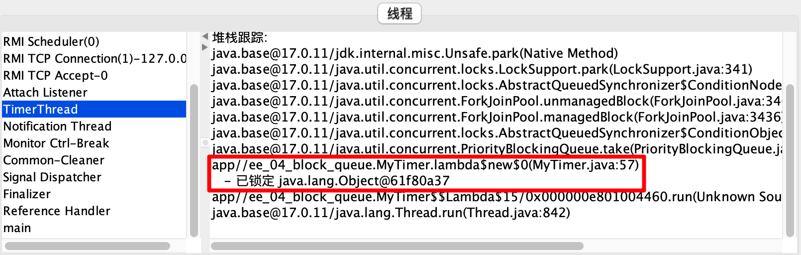

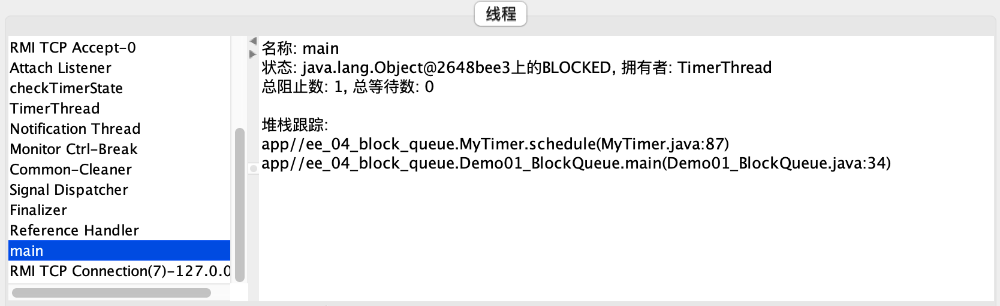

`TimerThread` 就是 `Mytimer` 中的扫描线程，`jconsole` 显示 `TimerThread` 线程处于 `WAITING` 状态，最近的堆栈追踪来自于 `MyTimer` 类文件的第 `57` 行代码，而第 57 行代码为 `task = tasksQueue.take();` ，表示当前阻塞队列为空，而 `TimerThread` 仍然去拿出数据，则进入 `WAITING` 状态，与上文分析的情况一致。main 就是主线程，`jconsole` 线程 `main` 线程处于 `BLOCKED` 状态，最近的堆栈追踪来自于由 `MyTimer` 类文件的第 `87` 行代码，而第 87 行代码为`locker.notifyAll();`，表示 `main` 线程正在等待 `locker` 锁对象的释放，同样与上文分析一致。

通过打印以下线程状态，使得产生死锁的情况更加清晰了：

```python
执行完毕 put 方法
执行第一个任务...
TimerThread : WAITING
tasksQueue.size() : 0
```

这表示主线程会率先执行 `put` 方法，然后扫描线程抢到锁，执行了放入的第一个任务，然后扫描线程再次通过锁竞争抢到了锁，由于阻塞队列为空，扫描线程因为阻塞队列进入了阻塞状态，无法释放 `locker` 锁，此时主线程也在等待 `locker` 锁，导致双方都在等待对方，造成死锁。

**解决方法：**

引入另外一个线程 `notifyThread`，是其每隔一段时间对 `locker` 锁对象管理的线程进行一次唤醒，因为这个线层是一个处理辅助任务的线程，设置为后台线程即可，使其随着进程的结束也随之结束。这样便取消了 `schedule` 方法中的 `notifyAll` 操作，使得执行 `schedule` 方法的线程不会去竞争 `locker` 锁，避免了死锁的产生。

```java
// 解决死锁的关键线程
private Thread notifyThread = new Thread(() -> {
    while (true){
        try {
           Thread.sleep(100); // 每隔 1 毫秒唤醒一次全部线程
        } catch (InterruptedException e) {
           throw new RuntimeException(e);
        }
        synchronized (locker){
           locker.notifyAll();
        }
    }
 });
```

在扫描线程睡眠等待时，可能会被多次唤醒，但仍然会继续等待时间，直到到达阻塞队列中最先执行的任务时间；而在扫描线层睡眠等到时有更紧急的任务进入，扫描线程也会被唤醒并重新 `take` 到任务，仍然可以 `put` 到最新的任务并执行（这里会有 `1` 毫秒左右的误差，是因为 `notifyThread` 是间隔 `1` 毫秒，唤醒一次线程的）；在扫描线程因为对空阻塞队列 `take` 任务时而进入 `WAITING` 状态，此时 `schedule` 方法没有了锁竞争，也可以顺利加入了任务，进而唤醒了扫描线程。

到这里死锁的问题就解决了，即使耗费了重复唤醒扫描线程以及 `1` 毫秒左右的误差，但是对于性能强大的计算机而言，可以使用户几乎感知不到，所以可以忽略不计，但最重要的是解决掉了会使得整个程序崩溃的死锁问题。

---

### 线程池

#### 构造函数

```java
 public ThreadPoolExecutor(int corePoolSize,
                           int maximumPoolSize,
                           long keepAliveTime,
                           TimeUnit unit,
                           BlockingQueue<Runnable> workQueue,
                           ThreadFactory threadFactory,
                           RejectedExecutionHandler handler) 
```

`JDK` 通过工厂模式给定了多个根据不同的参数创建线程池的方法，但是本质都是使用的上述 `ThreadPoolExecutor` 类的构造函数，所以理解这个构造函数的 7 个参数至关重要。

1. ```java
   1. int corePoolSize  // 核心线程数
   2. int maximumPoolSize  // 最大线程数。临时线程数 = maximumPoolSize - corePoolSize
   3. long keepAliveTime  // 临时线程的存活时间
   4. TimeUnit unit  // 临时线程存活时间的时间单位
   5. BlockingQueue<Runnable> workqueue  // 组织（保存）任务的阻塞队列，元素是 Runnable
   6. ThreadFactory threadFactory  // 线程工厂（暂时忽略）
   7. RejectExecutionHandler Handler  // 拒绝策略
   ```

#### 工作原理

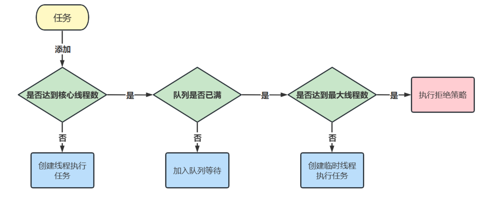

以火锅店为例：


1. 小伙伴周末去吃火锅，火锅店里有 6 张桌子（**核心线程数**），如果店里有空位就可以直接入座上菜吃火锅（**核心线程开始执行任务**）；
2. 随着到了饭点，人越来越多，6 张桌子都坐满了，后面来的人就要去排号，然后坐在店门口准备的等位小板凳上面，最多排到 20 号，因为一共准备了 20 个小板凳（**阻塞队列和队列的容量**）；
3. 火锅太好吃了，来的人越来越多，排到了 20 号，门口的凳子已经坐满了（**阻塞队列已经满容量了**），于是在店门口又加了 10 张临时的桌子（**启动了 10 个临时线程**）；
4. 排号的人依次去外面新搭建的临时桌吃饭（**临时线程开始执行任务**）；
5. 时间越来越晚了，随着一桌一桌的翻台（**线程的任务执行完毕**），排号的人都在店里吃上了饭，外面临时搭建的桌子就空出来了（**临时线程空闲**），再等 30 分钟，如果还没有人来吃饭，就把桌子撤掉了（**临时线程空闲状态下存活时间为 30 分钟，到了存活时间便销毁临时线程**）；
6. 外面的桌子撤掉以后，就剩下店里的 6 张桌子有人就餐（**最后的线程数量又回到了核心线程数**）
7. 如果中途排号的时候，人实在是爆满了，店里 6 张桌子和店外 10 张桌子都有人在就餐，店外的 20 个小板凳也都排满了号，那老板便不接待了，只好让后面来的客人去别的家了（**线程池能容纳的所有线程都在工作，并且阻塞队列也已经满了，便采取拒绝策略**）。
8. 如果店里的桌子能变多或者临时搭建的桌子变多或者等位的桌子也变多，那就可以一次性接纳更多客人。（增大 maximumPoolSize 和 阻塞队列的容量，便可以降低使用拒绝策略的概率）

#### 四种拒绝策略

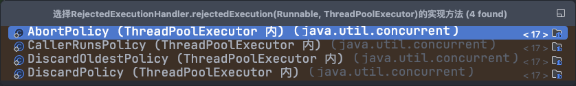

1. `ThreadPoolExecutor.AbortPolicy`：直接拒绝提交的任务，并抛出拒绝异常
2. `ThreadPoolExecutor.CallerRunsPolicy`：把提交的任务转给提交任务的线程执行
3. `ThreadPoolExecutor.DiscardOldestPolicy`：跳过最老提交的任务
4. `ThreadPoolExecutor.DiscardPolicy`：跳过最新提交的任务

---

## 多线程进阶

### 锁策略

1. **乐观锁 & 悲观锁**

   乐观锁：在多线程执行任务时，预期锁竞争程度不会激烈，那就可以先不加锁，等后面真正发生锁竞争后再加锁。

   悲观锁：在多线程执行任务时，预期锁竞争程度激烈，必须先加锁再执行任务。

2. **轻量级锁 & 重量级锁**

   轻量级锁：尽量停留在通过用户代码级别的锁，不会依赖于操作系统的 mutex 互斥锁，只会做少量的用户态与内核态之间的切换，通过 CAS + 自旋实现，轻度竞争场景下使用。

   重量级锁：完全依赖于操作系统的 mutex 锁，需要频繁在用户态于内核态之间切换，系统开销大，在自旋失败或者高并发竞争场景下使用。

   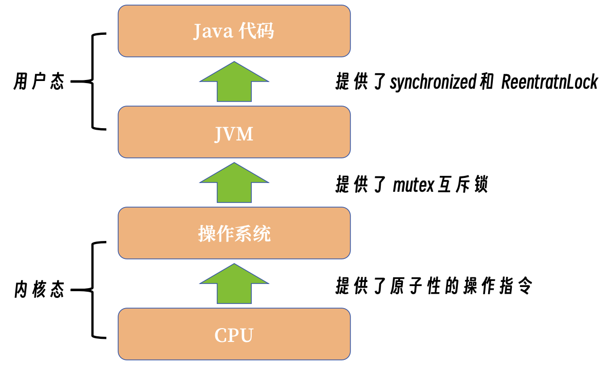

3. **自旋锁 & 挂起等待锁**

   自旋锁：不停地检查锁是否被释放，如果锁一旦释放，就可以直接获取锁资源。会使用 CPU 的 cmpxchg 指令。(轻量级锁的实现方式)

   挂起等待锁：阻塞等待，直到线程被唤醒，再去竞争锁资源。（重量级锁）

4. **读写锁 & 普通互斥锁**

   读写锁：分为读锁和写锁。

   ​	线程只涉及到读操作（共享锁），就使用读锁，多个读锁可以共存，但是不可以与写锁共存，即若一个变量正在被一个拥有读锁的线程读取，加了写锁的线程不可以修改这个变量。

   ​	线程涉及到了写操作（排他锁），就使用写锁，只允许有一个写锁执行任务，表示在同一时刻，只有一个拥有写锁的线程可以修改变量，写锁与其他所有锁都不能共存。

   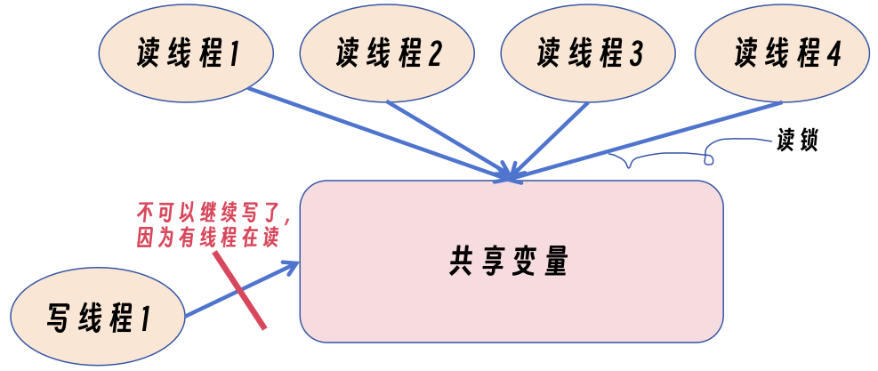

   普通互斥锁：保证了原子性，只有一个线程释放了互斥锁以后，其他线程才可以来抢，写锁就是一个互斥锁。

5. **公平锁 & 非公平锁**

   公平锁：先来后到，先排队的线程会提前拿到锁，后排的线程要等待前面的线程都拿到以后才可以重新拿到。

   非公平锁：单纯一个抢，谁抢到算谁的。

6. **可重入锁 & 不可重入锁**

   可重入锁：线程可以重复添加锁，在释放锁是也会多次释放锁，不会造成死锁。

   不可重入锁：线程不可以重复添加锁，否则会造成死锁。


#### **synchronized 是什么锁？**

synchronized 在 Java 中被高度实现了，会自动结合当前线程的竞争状态切换锁的状态。

	1. 既是乐观锁，也是悲观锁。
	1. 既是轻量级锁，也是重量级锁。
	1. 既是自旋锁，也是挂起等待锁。
	1. 互斥锁、非公平锁、可重入锁。（synchronized 保证原子性所以是互斥锁；线程自由竞争所以是非公平锁；线程可以重入，在释放锁时也会多次释放锁，所以是可重入锁。）

---

### CAS

CPU 的一个原子类操作，全称 compare and swap，通过硬件指令直接操作内存（`CMPXCHG`）。一个 CAS 涉及到以下操作：

（假设共享内存中变量的数据是 A，线程缓存中存储的旧的预期值是 B，线程所要修改后的新值是 C）

1. 首先从共享内存读取变量值为 A。（所以注意的是，CAS 操作也会有一个真正去主内存中读取值的操作）
2. 然后比较 A 与 B 是否相等。
3. 如果相等则把 C 写入共享内存（主内存）的变量中，并返回 true；如果不相等则不进行任何操作，并返回 false。

以上三步构成了 CAS 操作，**CAS 操作是一个原子类操作**，所以以上三步会一次性依次执行完毕。

伪代码如下：

```java
Boolean CAS(address, expectedValue, modifyValue) {
  if (&address == expectedValue){
    &address = expectedValue;
    return true;
  } else 
  	return false;
}
```

#### CAS 的 ABA 问题：

如果线程 1 修改了共享变量 `count` 后，线程 2 又把 `count` 重新修改回了原值，此时线程 3 在检查预期值与主内存中的值时，值是相等的，所以线程 3 认为 `count` 没有被修改，但是实际上 `count` 已经被修改了，引起线程安全问题隐患，这就是 ABA 问题（一开始是 A，然后修改成了 B，最后又修改回了 A）

**解决方法**：对 `count` 加一个线程的修改标签，通常是一个随机数🆔，每一个线程在修改了 `count` 后，都修改这个随机数🆔，相当于每一个线程修改后都会对这个变量做一个标记。所以预期值中除了存储此时变量的值也会存储变量对应的随机数🆔，在比较变量是否已经修改时，除了比较旧的预期值，还会比较这个随机数🆔，如果预期值一致，但是🆔不一致，则认为是存在 ABA 问题，进而给出反馈以做下一步处理。（可以通过时间戳、 `UUID` 等方式实现这个随机数🆔）。

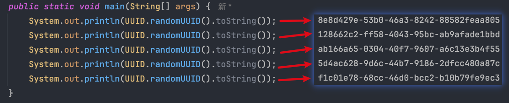

### 自旋锁

**Step1.** 线程把共享内存（主内存）中变量的值读取到自己的缓存（工作内存）中作为**预期值**。

**Step2.** 执行 CAS 操作，CAS 是一个原子类操作，是指令级别，通常是 cmpxchg

​	1）CAS 操作会再次读取共享内存中的变量值，并与预期值比较是否一致。

​	2）如果一致则表明当前所要修改的这个变量没有被其他线程修改过，所以直接把所要修改的值写入主内存中。

   3）如果不一致则表明当前线程所要修改的这个变量已经被其他线程修改过了，所以缓存中的预期值已经过时了，需重新循环执行第一步，直到 CAS 操作返回的是 true。

若线程一直处于循环的过程中，就是一个等待锁的操作（认为是阻塞 BLOCKED 状态），而这个阻塞状态实际就是一个不断循环的操作，故将其称为自旋锁。

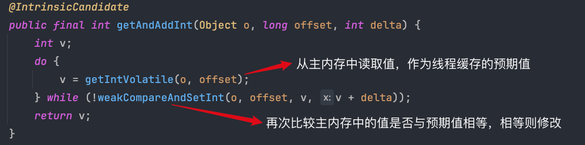

Java 同样有基于自旋锁的几个原子类（Atomic...），以 AtomicInteger 为例，在修改值时会采用 CAS 操作：

```java
AtomicInteger count = new AtomicInteger(0);
int ret = count.incrementAndGet();  // ++count
System.out.println("count: " + count);
System.out.println("ret: " + ret);
ret = count.getAndIncrement(); // count++
System.out.println("count: " + count);
System.out.println("ret: " + ret);
ret = count.decrementAndGet(); // --count;
System.out.println("count: " + count);
System.out.println("ret: " + ret);
ret = count.getAndDecrement(); // count--
System.out.println("count: " + count);
System.out.println("ret: " + ret);
```

### 锁升级

**无锁 ➡️ 偏向锁 ➡️ 自旋锁 ➡️ 重量级锁**

无锁：加锁代码块还未被线程执行，锁对象处于无锁状态。

偏向锁：有一个线程执行了加锁代码块，但还未触及锁竞争，锁对象处于偏向锁（JDK 8 之前，之后的 JDK 不包含偏向锁），锁对象会存储使用锁的线程信息。

自旋锁：两个线程同时执行加锁代码块，引起了轻度锁竞争，竞争状态不激烈，使用轻量级锁（CAS+自旋）。（thin-lock）

重量级锁：两个以上的线程执行加锁代码块，引起了重度锁竞争，竞争状态激烈，使用重量级锁。（fat-lock）

在 JDK 中，synchronized 会根据当前线程的竞争状态，自动进行锁策略的调控。

### 锁消除 & 锁粗化

**锁消除**是 synchronized 的一个优化策略，如果 JVM 100%确定度线程执行任务的时候不会出现问题是，才会执行锁消除（即不会真正地去加锁）

**锁粗化**是 synchronized 的一个优化策略，当线程整型下图示例中的代码逻辑时，JVM 会将其视为一个低效的操作，因此会把锁粒度拉粗，会优化成从方法 1 开始加锁到方法 4 执行完成之后再释放锁，将方法 1 -- > 方法 4 进行合并，优化成只用一个锁。

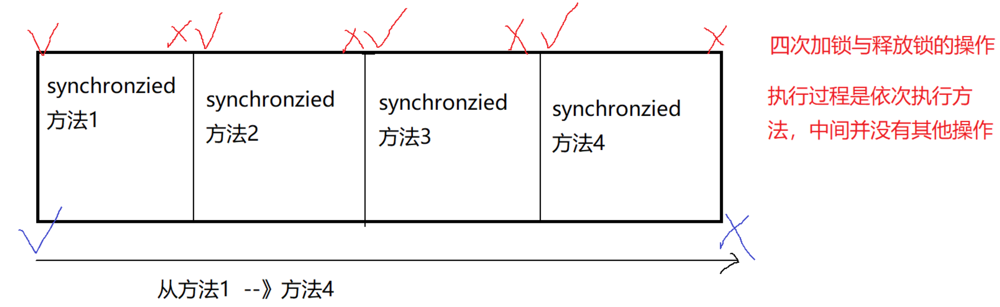

### Callable 接口

Callable 是 Java 的一个接口，可以用来定义线程执行的任务逻辑，使用时需要重写 Callable 的 call 方法，需要结合 FutureTask 类来构建一个线程，FutureTask 是一个泛型类，接收类型应与 Callable 的 call 方法返回值的类型相同，因为后续在接收这个值时，需要使用 FutureTask 的 get 方法，因此需要类型匹配一致。

```java
public static void main(String[] args) throws ExecutionException, InterruptedException {
    Callable callable_int = new Callable() {
        @Override
        public Object call() throws Exception {
            int ret = 0;
            TimeUnit.SECONDS.sleep(4);
            for (int i = 0; i < 100; i++) {
                ++ret;
            }
            return Integer.valueOf(ret);
        }
    };
    FutureTask<Object> futureTask = new FutureTask(callable_int);
    Thread thread_02 = new Thread(futureTask);
    thread_02.start();
    // 获取 callable 的 call 方法的返回值
    System.out.println(futureTask.get());
    // 因为 Callable 在执行任务时，可以抛出线程，故 get 方法要引入异常
    // 因为要获取执行任务的值，所以要等待线程执行完毕才能获取到，所以在等待的这个过程，线程进入阻塞状态。
}
```

在主线程调用 FutureTask 的 get 方法时，需要等待线程执行 FutureTask 的 Callable 接口的 call 方法执行完毕才可以获取到，因此这个方法可能会使线程进入阻塞状态。

Callable 接口的 call 方法可以抛出异常，因此在 get 方法调用处需要设置捕获异常的操作。

#### Runnable 与 Callable 接口的区别

1. 共同点：两个接口都可以把线程和其执行的任务逻辑进行解耦，都可以单独定义出线程执行的任务逻辑，Runnable 接口是重写 run 方法，Callable 接口是重写 call 方法。
2. 创建 Thread 对象时可以直接使用 Runnable 接口；而 Callable 需要事先实例化 FutureTask 对象，在把 FutureTask 对象传递给 Thread 方可构建一个线程对象。
3. Runnable 接口不可以抛出异常，方法中的异常处理只可以 try-catch 捕获；Callable 接口可以抛出异常。
4. Runnable 接口的 run 方法没有返回值；Callable 接口的 call 方法有返回值，需要通过 FutureTask 类的 get 方法获取。

如果需要获取线程执行任务完成后的一个变量值，如果使用 Runnable 接口定义线程则无法获取，但是 Callable 搭配 FutureTask 便可以获取到线程执行任务完毕后的结果。所以在我看来，如果需要获取线程执行任务的结果，则需要线层进行返回值，此时就应该使用 Callable。

### 创建线程的方式

1. 通过继承 Thread 类，重写 Thread 类的 run 方法。
2. 通过实现 Runnable 接口，将线程执行任务与线程对象进行解耦，使用 Runnable 接口构造一个 Thread 对象（函数式接口，使用 Lambda 表达式）
3. 通过实现 Callable 接口，除了可以解耦外还可以将线层执行认为时产生的异常抛出，使用 FutureTask 类构造一个 Thread 对象
4. 使用线程池的时候，会在线程池对象实例化时创建对应的线程去执行任务阻塞队列中的任务。

### ReentrantLock

ReentrantLock 是 Java 并发包 JUC 的一个类，是 Java 根据自身代码实现的**可重入互斥锁**。

#### 如何避免使用不当造成的死锁？

在使用过程中，首先使用 Reentrant 的 lock 方法来为后面的代码进行加锁以保证代码原子性，然后使用 unlock 方法解锁，使得当前线程释放锁，并再次与其他线程共同竞争锁，但是会出现下面的死锁问题：

1. 如果一个线程 A 在执行完 lock 方法后继续执行后续代码时出现了异常没有正确执行 unlock 方法，使得线程 A 一直握着这个锁放不开，进而使得其他线程一直在等待锁资源的释放，进而出现了死锁问题，所以**无论发生什么情况，都应执行到 unlock 方法，所以需要使用 try-finally 代码块，将 unlock 方法放在 finally 代码块内**，保证最后都会执行到 unlock 方法，避免了这一种情况的死锁问题。


2. 如果一个线程 A 执行锁的重入时，**执行多少次 lock 方法，就要执行多少次 unlock 方法**，否则也会出现一直握着锁放不开进而导致死锁的情况。


#### Condition 变量

`Condition` 是一个类，可以**在当特定的条件满足时才阻塞线程线程**的场景中使用，本质是一个阻塞队列，`awit` 方法执行完毕后则把当前线程放入阻塞队列中，并将其阻塞（执行后续方法），等到其他线程执行了 `signal` 或者 `signalAll` 方法后，就会把阻塞队列中的线程进行唤醒并出队。

1. 首先执行 `lock` 方法，获取锁，然后满足条件后执行 `awit` 方法，进而使得当前线程进入阻塞状态，线程释放锁，退出锁竞争。
2. 唤醒时也要先执行 `lock` 方法，获取锁，然后根据条件执行 `signalAll` 方法，唤醒阻塞的线程，使得其重新进入锁竞争。

所有的条件变量的阻塞与唤醒操作以及这些操作会对相应线程产生的影响，都要通过 `ReentrantLock`，所以与对 `synchronized` 理解相似，都是把锁看成一个中间商或者平台，来管理上锁、阻塞、唤醒等操作，如下图。


#### **ReentrantLock 对应的公平锁和非公平锁、读锁和写锁的使用**

```java
ReentrantLock lock = new ReentrantLock(); // 默认参数是 false，非公平锁
ReentrantLock lock = new ReentrantLock(true); // 传参是 true，公平锁
```

非公平锁表示线程自由竞争锁，公平锁则为先到先得，先去抢锁的线程拿到锁，然后依次给后面来的线程。

**读锁与写锁**

在我看来，读锁和写锁没有实际的应用场景，直接使用 synchronized 即可。

```java
// 先实例化一个 ReentrantReadWriteLock 对象
static ReentrantReadWriteLock readWriteLock = new ReentrantReadWriteLock();

// 使用 readWrite 对象单独定义读锁和写锁
ReentrantReadWriteLock.ReadLock readLock = readWriteLock.readLock();        
ReentrantReadWriteLock.WriteLock writeLock = readWriteLock.writeLock();


```

#### **`ReentrantLock` 的 `tryLock` 方法**

`tryLock` 是 `ReentrantLock` 提供的一种 **非阻塞锁获取机制**，尝试获取锁，如果锁可用则立即获取并返回 `true`，否则返回 `false`。与 `lock()` 相比，`tryLock` 不会阻塞线程，不会使线程出现一直死等的情况，适合需要快速响应或避免死锁的场景。

需要注意的是，**`tryLock` 也可以对线程进行上锁**，只是如果一个线程在规定的等待时间内还没有抢到锁资源，就会返回 `false`，然后程序可以去执行抢不到锁的对应语句，所以在使用 `tryLock` 时，不要忘记 `unlock`，但是线程只有在抢到 `ReentrantLock` 类规定的锁时，才可以执行 `unlock` 方法，否则会出现异常，因此要加以判断，抢到锁时执行 `unlock`，未抢到锁则不执行 `unlock`。


#### **`ReentrantLock` 与 `synchronized` 之间的区别**

1. **共同点：二者都是可重入互斥锁**

2. **工作的原理不同：**

   synchronized 是一个关键字，调用的系统 API；ReentrantLock 是一个类，是纯 Java 实现的。

3. **上锁和释放锁的方式不同：**

   ReentrantLock 需要通过实例化的对象管理线程，调用 lock 和 unlock 方法来上锁和释放锁，如果没有正常执行 unlock 方法，会因无法释放锁而产生死锁现象；

   synchronized 需要使用一个锁对象（任何对象都可以成为锁对象），进入代码块即上锁，退出代码块即释放锁，JVM 会自动加锁和释放锁。

4. **可重入锁的使用方式不同：**

   ReentrantLock 通过多次 lock 方法后，要手动配上对应次数的 unlock 方法，否则一样会因为无法释放锁而产生死锁现象；

   synchronized 进行重入锁后，会在锁对象中标记加锁次数，在代码块执行结束时会自动释放重入后的锁。

5. **线程等待锁的方式不同：**

   ReentrantLock 的 lock 方法会让线程一直等待锁资源的释放（死等）在参与锁竞争，但是 tryLock 方法可以制定线程等待锁的时间，到达等待时间后还未抢到锁就会放弃等待锁以执行其他逻辑；

   synchronized 则不能自由选择，线程只可以一直等待锁资源的释放在参与锁竞争。

6. **公平锁与非公平锁的指定方式不同：**

   ReentrantLock 在一开始创建实例时，可以给构造方法传参，默认是 false（非公平锁），传递 true 是公平锁；

   synchronized 无法指定公平锁与非公平锁，默认就是非公平锁，线程自由竞争，不会先来先得。

7. **线程阻塞时唤醒方式不同，但都是阻塞线程并且释放当前锁：**

   ReentrantLock 搭配 Condition 变量阻塞线程，await 是阻塞线程，signal 和 signalAll 是唤醒线程，注意需要先使用 ReentrantLock 对象上锁后方可调用 Condition 的 await 和 signalAll 方法，统一由 ReentrantLock 类进行中间管理，管理阻塞线程的方式更细粒度。

   synchronized 依托的是锁对象进行管理，直接调用 Object 类的 wait 和 notify、notifyAll 方法实现线程的阻塞与唤醒。

synchronized 能做的事，ReentrantLock 都可以实现；ReentrantLock 能做的事，synchronized 不一定可以，所以工作中要具体问题具体分析。

---

### JUC 的工具类

#### Semaphore 

#### CoutDownLatch

#### 多线程下使用 List

##### Collections.synchronized

##### CopyOnWriteArrayList

#### ConcurrentHashMap 

#### 

#### 


