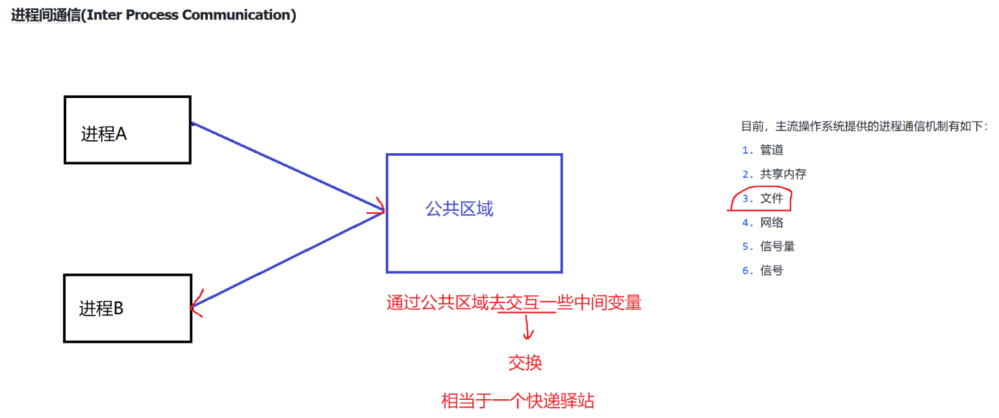

# JavaEE 学习笔记

## JVM

Java 的全部代码都运行在 JVM 上，JVM 通过对 Java 的相关操作进行编译，进而在不同的操作系统平台上面使用

与 C++ 不同的是，C++在面对 Linux、MacOS、Windows 等操作系统时，实现一个业务的逻辑需要写几套不同的代码，而 Java 一套代码就可以搞定，这都来自于 JVM 的功劳，JVM 可以根据当前 Java 所编写的代码在不同的运行平台上进行编译，进而得以在不同的操作系统下运行。

Java虚拟机（Java Virtual Machine, JVM）是执行 Java 字节码的运行时环境。它是 Java 技术的核心组件，负责实现 Java 的跨平台特性，同时提供内存管理、垃圾回收等重要功能。以下是 JVM 的详细介绍，包括其体系结构、工作原理、特点和常见问题。

### JVM 的作用

- **跨平台性**：JVM 提供了“**编译一次，运行到处**”的能力。Java 源代码被编译成平台无关的字节码（.class 文件），JVM 可以在不同操作系统中解释运行字节码。
- **内存管理**：JVM 自动分配和释放内存，开发者无需手动管理内存。
- **安全性**：JVM 提供了沙箱环境，限制程序访问系统资源，增强安全性。
- **多线程支持**：通过内置的线程模型，JVM 能高效管理并发执行的线程。
- **垃圾回收（Garbage Collection, GC）**：自动管理对象生命周期，回收不再使用的内存，减少内存泄漏问题。

## 操作系统

对上（软件）为软件提供了一个稳定的运行环境

对下（硬件）管理各种计算机设备

### 进程

运行的程序在操作系统中以进程的形式存在，** 是操作系统分配资源的最小单位 

#### 进程控制块抽象（PCB Process Control Block）

**1、PID：**进程编号，在操作系统当前运行环境中是唯一的

**2、内存指针：**每一个程序运行之前，操作系统都应在内存中为其分配一个内存空间，内存指针用于管理这块空间

**3、文件描述符表**

当程序运行起来之后需要访问一些文件资源，这时操作系统就负责为这些程序分配各种资源。程序需要的每一个文件，都是一个**文件描述符**，多个文件描述符合在一起，就组成了文件描述符表，类似于一个**集合**，在 Linux 中，所有的计算机设备，都是用文件的方式去描述（网卡、磁盘、外接设备等都是通过一个设备进行描述），默认每个程序运行时都会分配三个文件描述符：

默认每个程序运行时都会分配以下三个文件描述符：

标准输入：`System.in`

标准输出：`System.out`

标准错误：`System.error`

**4、进程状态：**就绪和阻塞

**5、进程调度：**

一个逻辑处理器，在处理许多进程时，采用的是轮换执行方法，由于 CPU 执行的频率很开因而人们察觉不出

**并发**：在一个逻辑处理器上**轮换执行**进程称为“并发”，重点是轮换执行

**并行**：在多个逻辑处理器上**同时处理**不同的指令称为“并行”，重点是同时处理

**在 Java 中，不对并发与并行进行区分，统称为“并发编程”。** 

**6、进程的优先级：**

对每个进程划分优先级，优先级越大，表示这个进程越有机会到 CPU 上执行。

**7、进程的上下文：**

进程在轮换执行时，会出现暂停执行（轮换出）和恢复执行（轮换到）两种状态，在轮换出是，需要保存进程执行的相关状态以便恢复执行时 CPU 可以得知当前进程执行到什么情况了，这是就需要将当前进程在寄存器中的数据存储到文到内存中，这个数据称为进程的上下文，在恢复执行时，将当前进程在内存中的上下文信息加载入寄存器中，CPU 得以继续执行。

进程暂停执行时：寄存器 ---> 内存

进程继续执行时：内存 ---> 寄存器

**8、进程的组织方式**

将每个进程抽象成一个 PCB，然后通过 PCB 以一个双向链表进行管理

查看所有的进程就是遍历这个双向链表

### 内存管理

使用 MMU（内存管理单元）同意虚拟内存的方式来管理进程对内存的使用


通过 MMU 对多个进程进行了内存的隔离，那么如何进行进程之间的通信来让多个进程协作完成一些任务呢？



## 多线程

#### 什么是线程


##### 线程与进程的区别

- 进程是包括线程的，每个进程至少有一个线程存在，即主线程。
- 进程和进程之间不共享内存空间，同一个进程的线程之间共享同一个内存空间。
- 进程是系统分配资源的最小单位，线程是 CPU 调度的最小单位。
- 一个进程挂了一般不会影响其他进程，但是一个线程挂了，可能会把同进程内的其他线程一起带走（整个进程崩溃）。

##### 多线程的场景

（过多线程会造成什么问题？）

1. 当线程的数量小于逻辑处理器的个数时，使用多线程操作能够提高程序处理任务的效率；
2. 当线程的数量大于逻辑处理器的个数时，使用多线程操作会拉低程序处理任务的效率，因为要涉及线程的不断摧毁与创建。

---

#### 如何创建线程

（继承 Thread 类、实现 Runnable 接口、Lambda 表达式）

**1、继承 Thread 类，然后重写 Thread 类中的 run 方法：**

```java
class Mythread extends Thread{
		@override
		public void run() {
        while (true) {
            try {
                Thread.sleep(1000);
            } catch (InterruptedException e) {
                throw new RuntimeException(e);
            }
            System.out.println("Hello, my little thread!");
        }
    }
}
  
// main()
Mythread demo = new Mythread();
demo.start(); // 开启线程，并执行线程中的 run 方法中的程序逻辑。
```

**2、实现 Runnable 接口，将线程类与业务逻辑解耦，符合高内聚，低耦合的编码理念：**

```java
// 定义具体的业务逻辑类
class MyRun implements Runnable{
  	@override
  	public void run(){
      	while (true){
            try {
                Thread.sleep(1000);
            } catch (InterruptedException e) {
                throw new RuntimeException(e);
            }
            System.out.println("Hello, my little thread!");
        }
    }
}

// main()
MyRun myRun = new MyRun(); // 实例化业务逻辑对象
Thread myThread = new Thread(myRun); // 调用另外一个构造方法，通过接收实现 Runnable 接口的对象创建
myThread.start(); // 开启线程，并执行线程中的 run 方法中的程序逻辑。
```

**3、因为 Runnable 接口只有一个方法，所以是一个函数式接口，可以使用 Lambda 表达式内部匿名重写方法：**

```java
// main()
Thread myThread = new Thread(() -> {
    	while (true){
            try {
                Thread.sleep(1000);
            } catch (InterruptedException e) {
                throw new RuntimeException(e);
            }
            System.out.println("Hello, my little thread!");
        }
  	}
);
myThread.start(); // 开启线程，并执行线程中的 run 方法中的程序逻辑。
```

---

#### 线程的各种属性

- `ID`：**`getID()`**  
  - `JVM` 中默认为 `Thread` 对象生成一个编号，是 `Java` 层面的，要和 `PCB` （操作系统层面的）区分开。
- 名称：**`getName()`**  
  - `Thread` 类还有一个构造方法可以同时接收 `Runnable` 的实现接口对象和 `String` 对象，来设置线程对象的名字。
- 状态：**`getState()`**
  - `Java` 层面定义的线程状态，要与 `PCB` 区分开。
- 优先级：**`getPriority()`**
- 是否后台线程：**`isDaemon()`**
  - 线程分为前台线程和后台线程，前台线程可以阻止进程的结束，主线程结束前台线程依然存在。
  - 后台线程则不能，主线程结束，后台线程也随之结束。
- 是否存活：**`isAlive()`**
  - 表示当前线程所对应的系统中的 `PCB` 是否销毁，与 `thread` 对象没啥关系。
  - `Thread` 是 `Java` 中的类 --> 创建 `Thread` 对象 --> 调用 `start()` 方法 --> `JVM` 调用操作系统 `API` 生成一个 `PCB` --> `PCB` 与 `Thread` 对象一一对应。
  - `Thread` 对象与 `PCB` 所处的环境不同（一个 `Java` 环境，一个操作系统环境），所以他们的生命周期也不同。
- 是否被中断：**`isInterrupted()`**
  - 通过设置一个标志位让线程在执行是判断是否要退出。

---

#### 线程是否存活

#### 线程中断

（自定义中断标志位，JDK 提供的方法）

1、自定义中断标志位要使用全局变量

2、等待状态的线程中断会报异常

#### 线程等待

thread.join() 等待一个线程结束在执行后续代码


