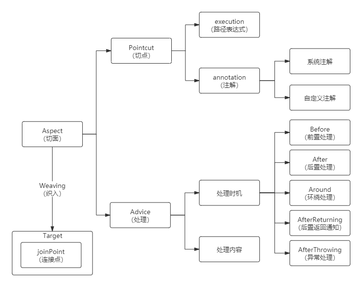

# Spring 关键技术原理总结

## Spring 拦截器

通过实现 **`HandlerInterceptor`** 接口自定义创建一个拦截器

```java
// 定义一个登录拦截器，需要实现 HandlerInterceptor
@Component
public class LoginInterceptor implements HandlerInterceptor {

  // 调用 Controller 的方法之前
  @Override
  public boolean preHandle(HttpServletRequest request, HttpServletResponse response, Object handler) throws Exception {
    HttpSession session = request.getSession(false);  // 设置为 False 表示如果没有 session 则不会自动创建
    if (session != null && session.getAttribute("userId") != null){
      return true;
    }
    System.out.println(request.getRequestURI());
    response.setStatus(401);
    response.setContentType("application/json;charset=UTF-8");
    String json = "{\"code\":401,\"message\":\"用户未登录，鉴权失败！\"}";
    response.getWriter().write(json);

    return false;
  }
  
}
```

然后将拦截器对象进行注册配置（需要实现 WebMvcConfigurer 接口创建一个配置类）

```java
@Configuration
public class WebConfig implements WebMvcConfigurer {
  @Autowired
  private LoginInterceptor loginInterceptor;
  @Override
  public void addInterceptors(InterceptorRegistry registry) {
    registry.addInterceptor(loginInterceptor)
      .addPathPatterns("/**")  // * 表示一级路径，**表示全部路径
      .excludePathPatterns(
      "/user/login",
      "/books/**",
      "/test/**"
    );
  }
}
```

**拦截器原理概括：**

- 在 Spring 服务启动时，会扫描 IoC 中的所有 Configuration bean，然后遍历其 addInterceptor 方法，把对应的拦截器进行添加。
- 在 Spring 服务运行时，DispatcherServlet 在匹配 url 与方法路由时，会遍历所有添加的拦截器：
  - DispatcherSevlet 实现了 Servlet 接口，其核心方法是 doDispath，用于匹配 url 与对应 Controller 和其响应方法，进而实现了接管 Tomcat 交付的url
  - 在调用 Controller 的方法之前，DispatcherServlet 会调用 applyPreHandle 方法，applyPreHandle 方法则是在遍历所有的拦截器，如果符合拦截规则，则进行方法的拦截处理。


## Spring AOP

在 Spring AOP 中，一个切面由切点和通知组成。Aspect = Pointcut + Advice

切点实则是一个规则，规定了切面控制的连接点的范围，连接点即为需要被切面代码进行增强的类或者方法，来使程序明确需要对哪些代码进行增强。

Advice 表示需要对选中的代码进行怎样的增强，处理的时机和处理的内容。



### Spring AOP 使用方式

（1）通过使用 execution 表达式实现

```java
@Slf4j
@Order(2) // 切面执行优先级
@Aspect  // 只有被该注解修饰才认为是切面类
@Component
public class AspectDemo01 {
    // 定义切点
    @Pointcut("execution(* com.kevinqiu.controller.*.*(..))")
    private void pointcut() {
    }

    // 定义环绕通知
    @Around("pointcut()")
    public Object aroundAdvice(ProceedingJoinPoint pjp) throws Throwable {
        log.info("AspectDemo01 -> aroundAdvice，计时开始");
        log.info("开始执行方法，计时开始");
        long startTime = System.currentTimeMillis();
        Object o = pjp.proceed();
        long endTime = System.currentTimeMillis();
        log.info("AspectDemo01 -> aroundAdvice，方法执行完毕，耗时 {} ms", endTime - startTime);
        return o;
    }
}
```

（2）通过使用自定义注解实现

适用于只想在部分 Controller 的部分方法中添加 AOP 的场景，需要注意，自定义注解只能修饰方法，也就是 `@Target` 的 `value` 传值只能是 `ElementType.METHOD`

```java
@Target(ElementType.METHOD)
@Retention(RetentionPolicy.RUNTIME)
public @interface MyPointCut {

}
```

```java
@Slf4j
@Aspect
@Component
public class AspectDemo03 {
    @Pointcut("@annotation(com.kevinqiu.aspect.MyPointCut)")
    public void pt(){}

    @Around("pt()")
    public Object aroundMyAnnotationAdvice(ProceedingJoinPoint pjp) throws Throwable {
        log.info("AroundDemo03 -> aroundMyAnnotationAdvice: Start.");
        Object o = pjp.proceed();
        log.info("AroundDemo03 -> aroundMyAnnotationAdvice: End.");
        return o;
    }
}
```

（3）通过 XML 的方式实现

XML 的方式是过去的技术，随着框架的不断更新，Spring 将其封装在注解中，通过动态生成 XML 的方式实现 AOP。XML 的方式主要有三种：经典代理、SpringAPI 以及自定义 XML 实现。

可以参考这篇文章：https://cloud.tencent.com/developer/article/2032268

### Spring AOP 实现原理

Spring AOP 是基于动态代理的方式实现的，在 Java 中，实现动态代理一共有两种方式，一个是 JDK 动态代理，另外一个是 CGLib 动态代理。而在 Spring 源码中，就是通过 JDK 和 CGLib 动态代理实现整体的 AOP 设计模式的。

CGLib 与 JDK 动态代理的不同点在于：JDK 只能实现接口的代理，而 CGLib 既可以进行接口的代理也可以进行类的代理，在 SpringBoot 2.x 之后，统一使用 CGLib。

`ObjectController`、`DemoController`、`JDKInvocationHandler`、`CGLibInterceptor`

```java
// 通过 JDK 的方式实现动态代理，进而实现 AOP
public static void JDKDynamicProxy() {
  ObjectController objectController = new DemoController();
  // 创建动态代理对象
  ObjectController controllerProxy = (ObjectController) Proxy.newProxyInstance(
    objectController.getClass().getClassLoader(),
    new Class[]{ObjectController.class},
    new JDKInvocationHandler(objectController)
  );
  // 通过代理调用方法
  String s = controllerProxy.printResult();
  log.info("JDKDynamicProxy: {}", s);
}

// 通过 CGLib 的方式实现动态代理，进而实现 AOP
// CGLib 与 JDK 动态代理的不同点在于，JDK 只能实现接口的代理，而 CGLib 既可以进行接口的代理也可以进行类的代理
public static void CGLibDynamicProxy(){
  DemoController demoController = new DemoController();
  // 创建动态代理对象
  DemoController controllerProxy = (DemoController) Enhancer.create(
    demoController.getClass(), new CGLibInterceptor(demoController));
  // 通过代理调用方法
  String s = controllerProxy.printResult();
  log.info("CGLibDynamicProxy: {}", s);
}
```

### Spring AOP 全流程分析

##### 第一阶段：容器启动与 AOP 代理的创建决策

此阶段在 Spring IoC 容器初始化 Bean 的过程中完成，是 AOP 功能的静态准备阶段。

1. **BeanDefinition 的扫描与注册**：Spring 容器启动时，通过组件扫描机制，将所有标识了 `@Component`、`@Service`、`@Aspect` 等注解的类，解析为 `BeanDefinition` 对象并注册到 `BeanFactory` 中。
2. **BeanPostProcessor 的介入**：Spring AOP 的核心 `AnnotationAwareAspectJAutoProxyCreator` 是一个 `BeanPostProcessor`。它的 `postProcessAfterInitialization` 方法会在 IoC 容器中**每一个** Bean 实例化并完成属性注入和初始化之后被回调。
3. **Pointcut 匹配与代理决策**：对于当前正在处理的 Bean，`AnnotationAwareAspectJAutoProxyCreator` 会执行以下判断：
   - 遍历容器中所有的切面（Aspects）。
   - 解析每个切面中的切点表达式（如 `execution(...)`），生成 `Pointcut` 对象。
   - 使用 `AopUtils.canApply(pointcut, beanClass)` 等工具方法，判断当前 Bean 的任何方法是否与任何一个 `Pointcut` 相匹配。
   - **若不匹配**：不进行任何额外操作，直接返回原始的 Bean 实例。
   - **若匹配**：标记此 Bean 为需要代理的对象，并进入代理创建流程。
4. **代理对象的生成与替换**：
   - Spring 会使用一个代理工厂（如 `ProxyFactory`）来创建 AOP 代理。
   - 代理工厂会根据目标 Bean 的特征决定代理策略：
     - 如果目标 Bean 实现了至少一个接口，默认使用 **JDK 动态代理**。
     - 如果目标 Bean 没有实现任何接口，或者配置了 `proxy-target-class=true`，则使用 **CGLIB** 创建子类代理。
   - 最终，`BeanPostProcessor` 返回的不是原始 Bean 实例，而是新创建的 AOP 代理对象。此代理对象会被存储在 Spring 的单例池中，并用于后续的依赖注入。

**此阶段总结：** Spring 容器初始化完成后，所有被 `Pointcut` 匹配到的 Bean 都已被其 AOP 代理对象所替换，应用程序的组件依赖关系中实际持有的是代理对象的引用。

---

##### 第二阶段：代理创建与 MethodInterceptor 链的构建

此阶段在决定创建代理时执行，核心任务是为每个需要增强的方法构建一个有序的 `MethodInterceptor` 链。

1. **查找适用的 Advice**：对于目标 Bean 中每一个匹配 `Pointcut` 的方法，AOP 框架会从所有切面中找出适用于该方法的所有通知（Advice），包括 `@Before`、`@After`、`@Around` 等。
2. **Advice 的排序**：框架会根据各 Advice 所在切面类的 `@Order` 注解或 `Ordered` 接口实现，对收集到的 Advice 列表进行全局排序，确保执行的确定性（Order 值越小，优先级越高）。
3. **Advice 到 MethodInterceptor 的转换**：为了在运行时以统一的方式处理，所有类型的 Advice 都会被包装（Wrap）成 `org.aopalliance.intercept.MethodInterceptor` 接口的实现：
   - **`@Around` Advice**：被包装为 `AspectJAroundAdvice`。这个拦截器在执行时，会将底层的 `MethodInvocation` 对象再次包装成 `ProceedingJoinPoint`，并将其作为参数传递给开发者编写的通知方法。
   - **`@Before` Advice**：被包装为 `AspectJMethodBeforeAdvice`。其 `invoke` 方法的内部逻辑是在执行完通知本身的逻辑后，直接调用 `invocation.proceed()`，将执行权传递给链中的下一个拦截器。
   - **`@After` Advice**（`finally` 语义）：被包装为 `AspectJAfterAdvice`。其 `invoke` 方法使用 `try...finally` 块包裹 `invocation.proceed()` 调用，以确保无论是否发生异常，通知逻辑都能在 `finally` 中执行。
   - 其他如 `@AfterReturning`、`@AfterThrowing` 也会被包装成相应的 `MethodInterceptor` 实现。
4. **拦截器链的缓存**：最终，针对每一个被增强的方法，都会生成一个**有序的 `List<MethodInterceptor>`**，其中包含了所有适用且已标准化为 `MethodInterceptor` 的 Advice。这个 `List` 就是该方法的拦截器链，它会被缓存在代理对象的元数据中（通常是一个 **`Map<Method, List<MethodInterceptor>>`**），以备运行时使用。

**此阶段总结：** AOP 代理对象在创建时，已经为其每一个需要增强的方法，预先构建并缓存了一个有序、统一的 `MethodInterceptor` 执行链。

---

##### 第三阶段：运行时方法调用与拦截器链的执行

此阶段在外部代码调用代理对象的方法时触发。

1. **代理拦截**：当代理对象的方法被调用时，调用会被拦截。在 JDK 动态代理中，会进入 `InvocationHandler` 的 `invoke` 方法；在 CGLIB 中，则会进入 `MethodInterceptor` 的 `intercept` 方法。
2. **创建 MethodInvocation**：代理逻辑不会直接调用目标方法。它首先从缓存中获取当前方法对应的 `MethodInterceptor` 链。然后，创建一个 `ReflectiveMethodInvocation` 对象，该对象封装了本次调用的所有上下文，包括：目标对象、代理对象、被调用方法、方法参数、拦截器链，以及一个用于追踪当前执行位置的索引（`currentInterceptorIndex`）。
3. **启动拦截器链**：代理对象调用 `ReflectiveMethodInvocation` 实例的 `proceed()` 方法。
4. **`proceed()` 的递归执行**：`proceed()` 方法是整个 AOP 调用链的核心驱动引擎。其内部逻辑如下：
   - 检查 `currentInterceptorIndex` 是否已经到达拦截器链的末尾。
   - **如果是末尾**：说明所有 Advice 都已执行完毕，通过 Java 反射（`method.invoke(target, args)`）调用原始的目标方法。
   - **如果不是末尾**：将索引加一，从链中获取下一个 `MethodInterceptor`，并调用其 `invoke` 方法。关键在于，`invoke` 方法的参数正是 `ReflectiveMethodInvocation` 自身（`this`），从而形成递归调用。
5. **不同拦截器的行为**：
   - 执行到 `AspectJMethodBeforeAdvice` 时，它运行通知代码后，其内部的 `invocation.proceed()` 会被自动调用，继续递归。
   - 执行到 `AspectJAroundAdvice` 时，它将 `MethodInvocation` 包装成 `ProceedingJoinPoint` 交给用户代码。用户必须手动调用 `pjp.proceed()`，这实质上是回调了 `MethodInvocation` 的 `proceed()` 方法，从而继续递归，所以在用户层，实际整个链路是否向后传递的控制权交还给了用户。
   - 执行到 `AspectJAfterAdvice` 时，它会在 `try` 块中立即调用 `invocation.proceed()`，让递归继续，自身则在 `finally` 中等待执行。
6. **结果返回与栈帧回溯**：目标方法执行完成后，返回值或异常会沿着递归调用栈逐层返回。在这个过程中，之前被挂起的 `AspectJAroundAdvice` 会从 `pjp.proceed()` 收到结果并继续执行后续代码，`AspectJAfterAdvice` 的 `finally` 块会被触发，最终结果被返回给最初的调用方。

**此阶段总结：** 运行时的 AOP 逻辑是一个由 `ReflectiveMethodInvocation` 对象管理的、基于 `MethodInterceptor` 链的递归调用模型。不同类型的 Advice 被标准化为行为模式固定的拦截器，共同参与到这个统一的调用链中，从而实现了在目标方法执行前后插入自定义逻辑的功能。

---

#### JDK 动态代理实现的原理

##### **通过 JDK 动态代理实现 AOP**：

1. **定义切面逻辑**：在 `InvocationHandler` 中实现增强逻辑：

```java
public class LoggingInvocationHandler implements InvocationHandler {
    private final Object target; // 目标对象（如 UserService）
 
    @Override 
    public Object invoke(Object proxy, Method method, Object[] args) throws Throwable {
        // 1. 前置增强：日志/权限校验 
        System.out.println("▶️  方法调用: " + method.getName()  + " | 参数: " + Arrays.toString(args)); 
        
        // 2. 执行目标方法 
        Object result = method.invoke(target,  args);
        
        // 3. 后置增强：结果处理/事务提交 
        System.out.println("✅  返回结果: " + result);
        return result;
    }
}
```

2. **创建代理对象**：通过 `Proxy.newProxyInstance` 绑定切面与目标对象

```java
UserService target = new UserServiceImpl();
UserService userServiceProxy = (UserService) Proxy.newProxyInstance( 
    target.getClass().getClassLoader(),
    new Class[]{UserService.class},  // 代理接口 
    new LoggingInvocationHandler(target) // 注入切面逻辑 
);
```

3. **通过代理调用方法**

```java
userServiceProxy.createUser("张三", 25); // 自动触发增强逻辑 
```

在 `Proxy.newProxyInstance` 的三个参数中，**接口类名和方法名的获取完全依赖第二个参数 `new Class[]{ObjectController.class}`** 。具体逻辑如下：

|       **参数**        |                      **作用**                       |                          **值来源**                          |
| :-------------------: | :-------------------------------------------------: | :----------------------------------------------------------: |
|     **类加载器**      | 根据这个加载器在内存中动态生成的代理类（`$Proxy0`） | 通常从目标对象类中提取（如 `objectController.getClass().getClassLoader()` ） |
|     **接口数组**      |   定义代理类需实现的接口（如 `ObjectController`）   |   开发者显式传入（`new Class[]{ObjectController.class}` ）   |
| **InvocationHandler** |             处理代理方法的实际调用逻辑              | 开发者自定义实现（如 `new JDKInvocationHandler(objectController)`） |

---

##### **JDK 创建动态代理的底层工作原理**

1. **动态构建代理类 `$Proxy`**

   - 在实际运行过程中，`JDK` 在执行 `Proxy.newProxyInstance` 时，会通过 `ProxyGenerator.generateProxyClass()` 在内存中生成 `.class` 字节码，这一过程会遍历用户传入的接口数组（如 `UserService.class` ），**精确解析并实现每个接口的方法签名**（包括方法名、参数类型、返回类型等），并生成对应的 `.class` 字节码文件（如 `$Proxy0.class` ）。随后由传入的 `ClassLoader` 加载，进而动态生成一个 `$Proxy0` 类，这个类继承了 `Proxy` 类并且实现了用户传入的接口（如 `public final class $Proxy0 extends Proxy implements UserService`）

2. 将接口中的所有方法进行汇总与映射

   - 在创建 JDK 动态代理时，JDK 首先会根据传入的代理接口，把接口中的方法签名与动态构建的代理类的方法签名进行映射，这一过程中，代理类为每个接口方法生成一个对应的静态 `Method` 对象（如 `m1 = ObjectController.class.getMethod("printResult")` ），建立 **方法签名 → `Method` 对象** 的映射表。

   - **示例伪代码**

     ```java
     public class $Proxy0 extends Proxy implements UserService {
         private static Method m1; // 映射 printResult()
       	private static Method m2; // 映射 getRequest()
         static {
           	// 实际会自动获取 Userservice 的全部方法签名并一一映射
             m1 = UserService.class.getMethod("printResult"); 
             m2 = UserService.class.getMethod("getRequest");
         }
         // ...
     }
     ```


3. 实现用户传入的所有代理接口：

   - 代理类重写的接口方法（如 `printResult()`）**固定调用父类 `Proxy` 中的 `InvocationHandler.invoke()`** ，实现逻辑集中路由。

   - **示例伪代码**

     ```java
     public class $Proxy0 extends Proxy implements UserService {
       // ...
       @Override
       public String printResult() {
         return super.h.invoke(this, m1, null);
       }
       
       @Override
        public String getRequest() {
         return super.h.invoke(this, m2, null);
       }
       // 这里的 super.h 是 Proxy 的成员变量，类型为 InvocationHandler，会在动态构建代理类是自动将用户传入的 Handler 进行赋值
     }
     
     ```

---

### Spring 的异常处理器与 Spring AOP 之间的关系：

Spring 的统一异常处理在**思想上**与 AOP 高度一致，但它的**底层实现机制**与我们之前讨论的标准 Spring AOP（基于代理）是**不同**的。**Spring MVC 的统一异常处理器（`@ControllerAdvice` / `@ExceptionHandler`）是一套独立的、专为 Web 层设计的机制，但它完美地体现了 AOP 的设计思想。**

下面我们来详细拆解这两者之间的关系。

#### 1. 思想上的一致性：为什么它“感觉”就是 AOP？

您之所以会这么问，是因为 Spring 的统一异常处理机制具备了 AOP 最核心的特征，它是一个典型的“面向切面”思想的应用：

- **分离横切关注点：异常处理是一个典型的横切关注点。如果没有统一异常处理，我们就需要在每个 Controller 方法内部都写大量的 `try-catch` 块，导致业务逻辑与异常处理逻辑高度耦合。`@ControllerAdvice` 允许我们将这些 `try-catch` 逻辑抽离出来，集中管理。
- **无侵入性（Non-Invasive）**：Controller 方法本身可以完全不关心异常处理的细节，只需专注于业务逻辑。异常处理的逻辑由框架在外部“织入”。
- **集中化管理**：所有的异常到 HTTP 响应的映射规则，都集中定义在一个或多个 `@ControllerAdvice` 类中，非常便于维护和扩展。

从这几点来看，它在设计哲学上**就是 AOP**。

---

#### 2. 实现上的差异：它究竟是如何工作的？

标准的 Spring AOP（`@Aspect`）是基于**动态代理**和**拦截器链**来实现的，它作用于 Spring IoC 容器中的任何 Bean。

而 Spring MVC 的统一异常处理机制，其核心是 **`DispatcherServlet` 的请求处理生命周期**，它并不依赖于 AOP 代理。

其底层工作流程如下：

1. **启动阶段**：Spring 容器在启动时，会扫描并加载所有被 `@ControllerAdvice` 注解的 Bean。然后，它会解析这些 Bean 内部所有被 `@ExceptionHandler` 注解的方法，并将其信息（能处理哪种异常、由哪个方法处理等）缓存在一个专门的解析器（如 `ExceptionHandlerMethodResolver`）中。

2. **请求处理阶段**：

   a.  客户端请求到达，由 DispatcherServlet 接收并处理。

   b.  DispatcherServlet 将请求分发给相应的 Controller 的方法（例如 `UserController.getUserById()`）。

   c.  DispatcherServlet 在调用 Controller 方法时，会在一个巨大的 try-catch 块中执行它。

3. **异常捕获与处理**：

   a.  如果在 Controller 方法执行期间，任何地方（包括其调用的 Service、DAO 层）抛出了一个异常，并且这个异常没有在业务代码内部被捕获，它会一直冒泡到 DispatcherServlet 的 try-catch 块。

   b.  DispatcherServlet 捕获到这个异常。

   c.  捕获后，DispatcherServlet 不会立即将异常抛给容器，而是会去查询在启动阶段建立的异常处理器缓存。

   d.  它会寻找一个能够处理当前抛出的异常类型（或其父类型）的 @ExceptionHandler 方法。

   e.  一旦找到匹配的处理器方法，DispatcherServlet 就会像调用一个普通的 Controller 方法一样，调用这个 @ExceptionHandler 方法，并将捕获到的异常实例作为参数传给它。

4. **响应生成**：`@ExceptionHandler` 方法执行其内部逻辑（记录日志、包装错误信息等），然后返回一个 `ResponseEntity` 或 `ModelAndView`。`DispatcherServlet` 拿到这个返回结果，再通过视图解析器或消息转换器，最终渲染成一个标准的 HTTP 错误响应（例如一个 JSON 错误体或一个错误页面）返回给客户端。

**核心区别**：标准 AOP 的触发点是**代理对象的方法调用被拦截**，而统一异常处理的触发点是**`DispatcherServlet` 在其请求处理流程中捕获到了异常**。

---

#### 3. `@AfterThrowing` 与 `@ExceptionHandler` 的对比

我们可以通过对比 AOP 的 `@AfterThrowing` 通知和 `@ExceptionHandler` 来更清晰地理解它们的差异。

| 特性             | Spring 统一异常处理 (`@ExceptionHandler`)                    | 标准 Spring AOP (`@AfterThrowing`)                           |
| ---------------- | ------------------------------------------------------------ | ------------------------------------------------------------ |
| **实现核心**     | `DispatcherServlet` 的请求处理生命周期                       | 动态代理 (JDK/CGLIB) 和拦截器链                              |
| **作用范围**     | **仅作用于 Controller 层**，处理 Web 请求过程中的异常        | 可作用于容器中**任何被代理的 Spring Bean**（Service, Component 等） |
| **主要职责**     | **转换异常为 HTTP 响应**。它的目标是为前端生成一个友好的错误反馈。 | **处理异常本身**。例如记录异常日志、发送监控告警、事务回滚的触发点等。它不关心前端如何展示。 |
| **对异常的控制** | **可以“消费”掉异常**。一旦匹配到处理器，异常就不会再向外传播。 | **不能“消费”异常**。它只是一个监听器，在异常抛出后执行一段逻辑，但异常本身会继续向外传播，除非你在通知里再抛一个新异常。 |

#### 总结

- 统一异常处理**是不是一种 AOP 处理？**

  - **从思想上说，是。** 它是面向切面思想的完美实践。
  - **从技术实现上说，它不使用 Spring AOP 模块的动态代理机制**，而是 Spring MVC 框架内置的一套独立的、基于 `DispatcherServlet` 事件循环的异常处理流程。

- 如何协同工作？

  它们可以完美地协同工作。一个典型的场景是：

  1. `Service` 层方法执行出错，抛出一个自定义的业务异常 `ResourceNotFoundException`。
  2. 一个标准的 AOP 切面 (`@Aspect`) 中的 `@AfterThrowing` 通知可以捕获到这个异常，并立即记录一条详细的错误日志或发送一个告警通知。
  3. 由于 `@AfterThrowing` 不会消费异常，`ResourceNotFoundException` 会继续传播到 `Controller` 层。
  4. `Controller` 层也没有捕获它，于是异常被抛给了 `DispatcherServlet`。
  5. `DispatcherServlet` 捕获异常，并找到一个由 `@ControllerAdvice` 定义的、专门处理 `ResourceNotFoundException` 的 `@ExceptionHandler` 方法。
  6. 这个处理器方法将异常转换为一个 HTTP 404 Not Found 响应，并返回一个 JSON 错误信息给前端。

---

## Spring 事务

@Transactional


---

## Spring Bean 的生命周期


---

## Spring 自动化配置

以下是第三方库自动配置 Spring Bean 的 4 种核心方法，按实现逻辑重新整理并补充关键说明：

---

### **一、基础扫描：`@ComponentScan`**  

- 原理：手动指定包路径，Spring 扫描该路径下所有 `@Component`、`@Service` 等注解的类并注册为 Bean。  

- 适用场景：明确知道第三方库的 Bean 所在包路径时使用。  

- 示例：  

  ```java
  @Configuration
  @ComponentScan("com.third.party.lib") 
  public class AppConfig {}
  ```

---

### **二、动态导入：`@Import` + `ImportSelector 接口`**  

- 原理：通过实现 `ImportSelector` 接口编程式返回需导入的配置类全限定名（字符串数组），结合 `@Import` 动态加载。  

- 优势：可根据条件（如配置文件）动态决定加载哪些配置。  

- 示例：  

  ```java
  public class CustomImportSelector implements ImportSelector {
      @Override
      public String[] selectImports(AnnotationMetadata metadata) {
          return new String[]{"com.third.party.lib.ConfigA", "com.third.party.lib.ConfigB"};
      }
  }
  
  @Configuration 
  @Import(CustomImportSelector.class)
  public class MainConfig {}
  ```

---

### **三、启用注解封装：`@Enable` 模式**  

- 原理：自定义注解（如 `@EnableCaching`），内部通过 `@Import` 导入配置类或 `ImportSelector` 实现类。  

- 设计意图：对用户隐藏复杂配置，提供声明式启用接口。  

- 示例：  

  ```java 
  @Target(ElementType.TYPE)
  @Retention(RetentionPolicy.RUNTIME)
  @Import({CacheConfig.class, CacheSelector.class})  // 封装导入逻辑
  public @interface EnableCustomCache {}
  
  @EnableCustomCache  // 用户只需添加此注解 
  @SpringBootApplication
  public class Application {}
  ```

---

### **四、Spring Boot 自动配置：`@EnableAutoConfiguration` 机制**  

两种实现方式（需依赖 `spring-boot-autoconfigure`）：  

1. `@AutoConfigurationPackage` (旧方案)  
   - 自定义类标注 `@AutoConfigurationPackage`，将其路径加入扫描范围（通过 `@Import(AutoConfigurationPackages.Registrar.class)` 实现）。  
   - 局限：Spring Boot 2.7 后逐步淘汰，主要用于兼容旧项目。  

2. `AutoConfiguration.imports` 文件 (Spring Boot 2.7+ 推荐)  
   - 在第三方库的 `META-INF/spring/` 目录下创建文件：  
     文件名：`org.springframework.boot.autoconfigure.AutoConfiguration.imports`  
   - 内容：每行一个自动配置类的全限定名（如 `com.third.party.lib.AutoConfig`）。  
   - 触发条件：项目使用 `@SpringBootApplication`（隐含 `@EnableAutoConfiguration`）时自动加载。  
   - 优势：无需代码侵入，符合 Spring Boot "约定优于配置" 理念。  

---

✅ 方法对比总结  

| 方法                        | 适用场景                   | 复杂度 | Spring Boot 依赖 |
| --------------------------- | -------------------------- | ------ | ---------------- |
| `@ComponentScan`            | 明确知道 Bean 所在包路径   | 低     | ❌                |
| `@Import + ImportSelector`  | 需动态控制加载逻辑         | 中     | ❌                |
| `@Enable`                   | 为第三方库提供简洁启用入口 | 中     | ❌                |
| `AutoConfiguration.imports` | 深度集成 Spring Boot 生态  | 低     | ✅                |

> 最佳实践：  
>
> - 开发通用第三方库时，优先采用 `AutoConfiguration.imports` 文件（Spring Boot 2.7+）或 `@Enable` 注解。  
> - 动态加载需求选 `ImportSelector`，简单扫描场景用 `@ComponentScan`。

---

## **Spring 怎么知道需要导入哪些库中的 bean？**

Spring 会通过类加载器（ClassLoader）扫描 `classpath` **中的所有 JAR 包**（包括 POM 引入的依赖）。当依赖中包含 `spring-boot-autoconfigure` 包时，才会激活自动配置机制（如 `mybatis-spring-boot-starter` 内部依赖了它）。然后去扫描这个`spring-boot-autoconfigure`下的

`META-INF/spring/org.springframework.boot.autoconfigure.AutoConfiguration.imports` 文件，然后根据文件中的路径再进行扫描，最终导入这个依赖规定的 `bean`。

### @SpringBootApplication 的背后原理


Spring 会使用到 **`@ComponentScan`** 和 **`@EnableAutoConfiguration`** 两个注解进行自动化 `Bean` 配置：

- `@ComponentScan` 表示扫描路径是当前路径，

- `@EnableAutoConfiguration` 主要包括 `@AutoConfigurationPackage` 和 `@Import`：

  - `@Import` 传递的是 `AutoConfigurationImportSelector.class`，`AutoConfigurationImportSelector` 类实现了 **`ImportSelector`** 接口的 `selectImports `方法，会据`org.springframework.boot.autoconfigure.AutoConfiguration.imports` 文件进行默认导入

  - 导入过程中会通过 `@ConditionalOnClass` 注解检查类路径是否存在相关依赖，基于通过 `SpringFactoriesLoader` 读取所有依赖自定义的的 `AutoConfiguration.imports` 文件

  - `@AutoConfigurationPackage` 中也有一个 `@Import` 接口，传递的是 **`AutoConfigurationPackages.Registrar `** 类，这个类同样也会传递一些需要导入的 `Bean` 的路径字符串数组

  - **`Registrar`「坐标锚点」**—— **用于通知 Spring 寻找用户在当前项目中定义的 `bean` 的主包根路径**
    → 仅向容器注册**主应用根包路径**（如 `com.kevinqiu.spring-demo` → `com.kevinqiu` ）
    → **不涉及任何第三方库配置**

  - **`ImportSelector`是「库装载器」**—— 来告知 Spring 需要导入依赖库中定义的那些 `bean`
    → 通过 SPI 机制扫描所有依赖的 `META-INF/spring/` 目录
    → 加载 `AutoConfiguration.imports` 中声明的**配置类全限定名**
    → 触发 **`@Conditional` 条件校验**后实例化三方库 Bean（如 `SqlSessionFactory`）

  - `Registrar` 与 `ImportSelector` 二者通过 `@EnableAutoConfiguration` 协同工作，但**职责完全分离**

---

## @RequestParam 和 @RequestPart

```java
@RequestMapping("/prize/test")
public String testUpload(@Validated @RequestPart("param") PrizeCreateParam param) {
  log.info("createPrize -> PrizeCreateParam: {}",param);
  return "ok";
}

```

对于存储表单数据的 Http 报文，Spring 会把一个个表单元素认为一个个小的 Http 报文。

这两个两个注解都可以接收并处理表单（Content-type=multipart/form-data）中的数据，区别在于@ReqeustPart 需要在客户端发来的报文中明确把 Content-type 设置为 application/json，如果字段缺失了 Content-Type，Spring 默认会认为当前的报文Content-type 为 application/octet-stream，然后需要将application/octet-stream 类型的报文转换成指定的对象，而Spring 并没有提供这种 converter，导致找不到 converter，进而抛出 HttpMediaTypeNotSupportedException，异常内容就是不支持 application/octet-stream 的 Content-type。

而 @RequestParam 就不会管这个，无论前端传递什么样的 Content-type，都会将其内容当作字符串进行传参，用户可以自行再进行反序列化，这样即使前端没有设置 Content-type 或者 Content-type 设置为 text-plain 等，都会将报文中载荷设置为字符串进行传递，这样就稳得多了，但需要注意，需要使用 String 进行接收参数。

---

## 分布式锁（基于 Redis）

好的，我们来详细说一下基于 Redis 的分布式锁。

分布式锁是在分布式系统中，用来协调不同节点（或进程）对共享资源的访问，以避免并发冲突和数据不一致问题的关键机制。

Redis 因为其高性能、原子操作和简单的部署特性，成为了实现分布式锁最常用的工具之一。

### 为什么要用 Redis 实现分布式锁？

1. **高性能**：Redis 是基于内存的数据库，读写速度极快，可以有效降低获取和释放锁带来的性能开销。
2. **原子操作**：Redis 提供了许多原子命令（如 `SETNX`），这些命令在执行过程中不会被其他命令打断，这是实现锁安全性的基础。
3. **简单易用**：相对于 ZooKeeper、Etcd 等其他分布式协调工具，使用 Redis 实现锁的逻辑更简单，也更容易部署和维护。
4. **高可用性**：Redis 提供了哨兵（Sentinel）和集群（Cluster）模式，可以搭建高可用的 Redis 服务，从而保证锁服务的稳定性。

---

### Redis 分布式锁的实现演进

实现一个可靠的 Redis 分布式锁，需要解决几个核心问题：**互斥性、防死锁、防误删**。下面我们通过一个演进过程来看如何解决这些问题。

#### 版本 1：最基础的实现 (`SETNX`)

最简单的想法是使用 `SETNX` (`SET if Not eXists`) 命令。

- **获取锁**：客户端尝试执行 `SETNX lock_key 1`。
  - 如果命令返回 `1`，表示 key 不存在，客户端成功获取锁。
  - 如果命令返回 `0`，表示 key 已存在，获取锁失败。
- **释放锁**：客户端执行 `DEL lock_key`。

存在的问题（致命缺陷）：

如果一个客户端获取锁后，业务逻辑出现异常或者服务宕机，它就永远无法执行 `DEL` 命令。这将导致死锁，其他客户端再也无法获取该锁。

#### 版本 2：加入过期时间 (`SETNX` + `EXPIRE`)，最好的加锁机制

Redis 2.6.12 版本之后，`SET` 命令增加了很多强大的选项，可以让我们用一条命令原子地完成“加锁并设置过期时间”的操作。这是目前**推荐的加锁方式**。

- **获取锁（正确姿势）**：

  ```
  SET lock_key unique_value NX EX 30
  ```

  - `lock_key`: 锁的唯一标识，例如 `lock:product:123`。
  - `unique_value`: 一个唯一的客户端标识（比如 UUID 或随机字符串）。**这个值非常重要，用于安全地释放锁，防止 A 服务释放了 B 服务的锁**。
  - `NX`: (Not eXists) 仅在 `lock_key` 不存在时才设置。这保证了互斥性。
  - `EX 30`: (EXpire) 设置键的过期时间为 30 秒。这解决了死锁问题。

这条命令是原子的，完美地解决了版本 2 的问题。

------

### 如何安全地释放锁？

现在我们有了一个看似完美的加锁机制，但释放锁依然有陷阱。

错误的释放方式：检查当前锁的 unique_value 是否为当前客户端，如果是则直接 DEL lock_key。

问题场景（非原子性判断锁信息，造成锁的误删除）：

1. 客户端 A 获取了锁，过期时间为 30 秒。
2. 客户端 A 的业务逻辑执行完毕，判断锁信息是否与当前客户端一致再释放。
3. 客户端 A 走完判断条件后，确定锁信息一致，开始释放锁，但此时客户端 A 宕机了，一致没有执行 DEL。
4. 客户端 A 的锁过期，触发了自动释放操作。
5. 客户端 B 此时检测到锁已释放，于是成功获取了该锁。
6. 客户端 A 进程恢复，开始执行 DEL，结果导致了误删除了 B 的锁。

#### 正确的释放方式：使用 Lua 脚本

为了避免误删，客户端在释放锁时，必须先判断当前锁的持有者是不是自己，同时还要保证原子性。这就需要用到我们之前存入的 `unique_value`。

这个“**判断-再删除**”的过程必须是原子的，否则在 `GET` 和 `DEL` 之间，锁可能已经过期并被其他客户端获取。Redis 内部保证了 Lua 脚本是具备原子性的。

- 释放锁（正确姿势）：

  执行以下 Lua 脚本：

  ```lua
  if redis.call("get", KEYS[1]) == ARGV[1] then
      return redis.call("del", KEYS[1])
  else
      return 0
  end
  ```

  - `KEYS[1]` 就是 `lock_key`。
  - `ARGV[1]` 就是 `unique_value`。

执行逻辑：脚本会先获取 lock_key 的值，与客户端传入的 unique_value 进行比较。如果值相同，说明锁确实是该客户端持有的，可以安全地执行 DEL；如果不同，则不执行任何操作。由于整个 Lua 脚本在 Redis 中是原子执行的，因此可以完美解决误删问题。

---

### 锁的超时时间设置

锁的过期时间应该设置多长？

- **过短**：业务逻辑还没执行完，锁就过期了，导致其他线程/进程进入，引发并发问题。
- **过长**：如果持有锁的客户端宕机，其他客户端需要等待更长的时间才能获取锁。

一个常见的解决方案是**锁续期（Lock Renewal）**，也叫“**看门狗（Watchdog）**”机制。**客户端在获取锁后，启动一个后台线程，在锁的过期时间到达之前，如果业务还在执行，就自动延长锁的过期时间。当业务执行完毕后，再主动释放锁并停止续期线程。Java 的 Redisson 库就内置了这种机制。**

**看门狗底层机制分析：**

- **上锁与启动**：业务线程在 Redis 中**注册**一个锁，成功后，**启动**一个看门狗后台线程。

- **持有与续约**：在业务线程执行任务期间，只要没有调用 `unlock()` 来释放锁，后台的看门狗就会**自动**、**周期性地**为锁**续约**，防止它过期。

- **释放与结束**：业务线程任务完成后，调用 `unlock()` 方法，它会主动**释放**在 Redis 中的锁，并**结束（终止）**那个一直在后台工作的看门狗线程。

- **线程或进程崩溃（被动停止）**：假设持有锁的主线程遇到了未捕获的异常，或者整个 JVM 进程直接崩溃了，所以看门狗的线程也一并死亡了，进而导致看门狗永远无法向服务器发送续期的请求，最终 Redis 中的这个锁在等待最后一个续期周期（例如 30 秒）结束后，就会因 TTL (Time To Live) 到期而被 Redis **自动删除**。

### 可重入性

可重入锁指的是同一个线程可以多次获取同一个锁而不会被自己阻塞。要实现可重入，可以在锁的 value 中存储一个计数器。每次重入时，判断持有者是自己，然后将计数器加一。释放锁时则减一，直到计数器为 0 时才真正删除 key。

### 主从架构下的问题与 Redlock

如果你的 Redis 部署是主从（Master-Slave）模式，可能会遇到一个极端问题：

1. 客户端 A 在 Master 节点上成功获取了锁。
2. 在 Master 将该锁同步到 Slave 节点之前，Master 宕机了。
3. 哨兵（Sentinel）将一个 Slave 提升为新的 Master。
4. 客户端 B 尝试在新 Master 上获取锁，由于新 Master 上没有这个锁的数据，客户端 B 也成功获取了锁。
5. 这样就导致了两个客户端同时持有同一个锁。

为了解决这个问题，Redis 的作者提出了 **Redlock（红锁）** 算法。其核心思想是：客户端需要向多个独立的 Redis 实例（通常是 5 个）发起加锁请求，只有当**超过半数（例如 3/5）**的实例都成功加锁时，才算真正获取了分布式锁。

不过，Redlock 算法也存在争议，一些分布式系统专家认为它在某些网络分区或时钟漂移的场景下依然不够安全。对于绝大多数应用场景来说，单实例的 Redis 锁（配合高可用的部署）已经足够健壮了。

------


